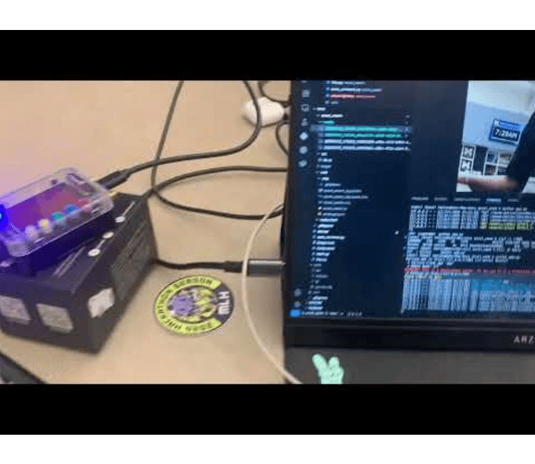
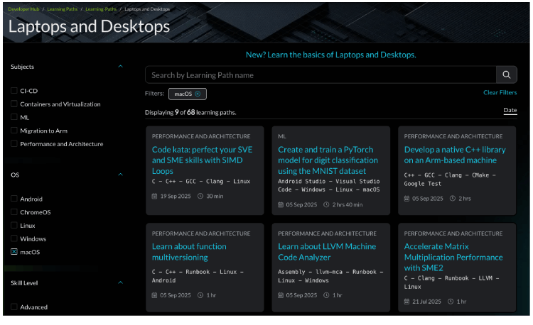
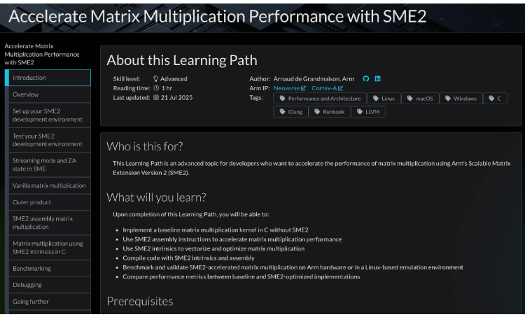
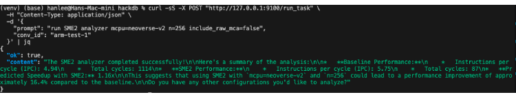
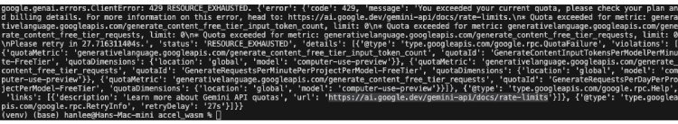

> Agent Unblind handles sending email to customer, generating invoice, and take a photo and analyze the photo along with prompt, auto photo capturing system of thief upon our motion detection.

import MyCarousel from '@site/src/components/Carousel';

{/* <MyCarousel /> */}

export const slides = [
  { type: 'video', src: 'iZ00LBi73io' }, // YouTube video
  { type: 'image', src: '/img/blog/agent-unblind.jpg', alt: 'agent-unblind', caption: "" },
];

<MyCarousel slides={slides} />

<!-- truncate -->

<br/>

## ✨ Inspiration

More than 1.8 million business owners with disabilities in the U.S. often must overcome unique barriers to entrepreneurship as they strive to compete alongside their non-disabled counterparts in a business world that does not fully recognize their abilities and resilience.  

**Source:** [National Disability Institute Report](https://www.nationaldisabilityinstitute.org/reports/small-business-ownership-pwd-challenges-and-opportunities/)

I personally don't believe in "ability" and "disability". People that are blind or "disabled" just need a curated tool or pool of tools to enable themselves to do anything.  
I would not call someone "disabled" just because he cannot stick a nail to the wall without a hammer. People generally need **tools** to do tasks.  

"Disabled" or blind people specifically just need more customized tools. That's why I developed **Agent Unblind** that uses Text-to-Speech and Speech-to-Text to interact with the tool-calling/invoking agent built with **ASI LLM** as the reasoning brain that calls a chain of tools to do tasks.

I built customized tools such as:
- Signing up with credentials  
- Logging in  
- Getting my customer list  
- Sending email to customer  
- Generating invoice and sending an email with an invoice  
- Using camera to analyze a photo that is taken after opening the camera  

I also built a **theft detection system** with **FREE-WILi** that uses accelerometer data streamed to our Dashboard app through **WASM (Rust → wasm-bindgen)** and real-time data visualization of acceleration data of x, y, and z axes.

## 🛒 What it does

- **Agent capabilities:**
  - Sends email to customers  
  - Generates invoices  
  - Takes and analyzes photos along with prompts  
  - Auto photo capturing system of thief upon motion detection  

- **Motion detection:**
  - Detects motion in a local WASM web app (port `7001`) and snaps a photo to `media/`.  
  - Analyzes the most recent frame with **Gemini** to describe clothing, visible traits, and scene context (e.g., “1 person; black hoodie; white sneakers; backpack; near the register”).  
  - Speaks alerts using **ElevenLabs TTS** (“Motion detected. Theft alert!”).  

- **Agentic workflows via ASI:**
  - Voice commands like:
    - “Sign me up”
    - “Log in”
    - “Add a customer”
    - “Email the incident”
    - “Analyze the latest frame”
  - The agent calls FastAPI tools automatically.  

- **Customer & Auth Layer (MongoDB):**
  - Sign up and log in (JWT)
  - Create/list customers — scoped per user  

- **Utilities:**
  - Generate PDF invoices  
  - Send emails with attachments  
  - Run an ARM SME2 static analyzer (demo of domain tools)  

## 🛠 How we built it

### Architecture Overview

#### Frontends

- **localhost:7001 (Flask/WASM)**  
  Motion sensing, live capture, media hosting, and a `/capture_now` endpoint.  

- **Agent Unblind UI**  
  A simple Bootstrap page with mic capture that uploads audio to `/transcribe_and_run`, shows transcript + agent reply, and plays TTS.

### Services

- **localhost:8000 (FastAPI “Tools API”)**  
  Endpoints:
  - `/tools/signup`
  - `/tools/login`
  - `/tools/get_myid` (JWT → user scope)
  - `/tools/put_customer`
  - `/tools/get_customer`
  - `/tools/make_invoice`
  - `/tools/send_email`
  - `/tools/send_invoice_email`
  - `/tools/camera_analyze` (webcam → Gemini)
  - `/tools/analyze_thief_most_recent` (latest snapshot → Gemini)
  - `/tools/arm_sme2/analyze` (mounted SME2 analyzer)

- **JWT Auth:** HS256 with `iss/aud`, helper to derive `user_id` from Bearer token.  
- **MongoDB:**  
  - `users` collection (bcrypt hashes, unique indexes)  
  - `customers` collection (scoped by user_id + email)

### Agent Layer

- **agent/asi_toolcaller.py**
  - Sends chat + OpenAI-style tool schema to **ASI**
  - Executes returned tool calls against port `:8000`
  - Persists JWT in session and auto-injects JWT for scoped tools
  - Exposes shim on port `:9100` for the voice UI  

- **uAgents**
  - Runs locally on port `:9200` with Agentverse inspector enabled
  - Maintains conversation state and tool history
  - Clean separation of concerns:
    - **Agent** → policy + tool orchestration  
    - **FastAPI service** → capabilities  

### AI Integrations

- **Gemini (google-genai)** for image understanding (JSON schema when possible)  
- **ElevenLabs**
  - **STT:** scribe_v1  
  - **TTS:** multilingual v2  

### Port Map

| Port | Description                    |
|------|--------------------------------|
| 5000 | Main “Agent Unblind” Web app   |
| 7001 | FREE-WILi WASM Dashboard App   |
| 8000 | Tools API (FastAPI)            |
| 9200 | uAgents internal server        |
| 9100 | Local “shim” HTTP (optional)   |

A small FastAPI endpoint (`POST /run_task`) is used to trigger the agent’s ASI tool-calling loop via `curl` for development convenience.

## 🤖 Use of uAgents

- Runs local agent (`asi-toolcaller`)  
- Maintains conversation state and tool history  
- Stores JWT + user_id after login and auto-injects for scoped calls  
- Exposes message handler and lightweight HTTP shim for voice UI  
- Clean separation of logic: agent (policy/orchestration) vs. service (capabilities)

## 🕹️ Use of Agentverse

Integration with **Agentverse inspector** for real-time observation of agent behavior and tool invocations.

## 🧠 Use of ASI

- Calls `https://api.asi1.ai/v1/chat/completions`  
- Uses tools schema (OpenAI-style) with `tool_choice="auto"`  
- Model used: **asi1-mini**  
- Interprets natural language requests like:
  - “Sign me up”
  - “Log in”
  - “Analyze the latest scene”  
- Returns structured tool calls that are executed and fed back as `role:"tool"` turns  
- Custom tools added:
  - `signup`, `login`, `get_myid`
  - `put_customer`, `get_customer`
  - `analyze_thief_most_recent`

## 🦈 Use of FREE-WILi

### Motion Sensor + WASM Dashboard + Voice Alert Overview

A browser-based theft-detection dashboard that:

- Reads live accelerometer data from a **FREE-WILi** device over Web Serial  
- Processes signals in **Rust wasm-bindgen** for fast and consistent detection  
- Visualizes data (`m/s²` + EMA)  
- Triggers **ElevenLabs TTS** alert —  
  “Motion detected, theft alert!” whenever movement crosses a threshold.

Click Image to see Demo of Theft Prevention System powered by FREE-WILi and WASM
[](https://www.youtube.com/watch?v=LX4KK7t_iYM)

## ⚙️ Architecture (end-to-end)

FREE-WILi streams raw accelerometer counts (x, y, z) and the current LSB-per-g scale over serial USB.

Browser (Web Serial API) reads those lines in real time.

Rust → WebAssembly (wasm-bindgen) converts counts → m/s², maintains an Exponential Moving Average (EMA) of |a|, and raises an alarm when |a| deviates from 1g by ≥ threshold.

Dashboard (HTML/JS) plots ax, ay, az, |a|, EMA, updates status badges, and logs events.

ElevenLabs voice alert fires via a small /speak-motion endpoint (so the API key stays server-side) and plays back in the browser.

## 🧠 Motion detection logic (why it works)

Gravity at rest is ~1 g. Any significant motion changes the magnitude |a| = √(ax² + ay² + az²).

Convert counts → g using the device’s LSB per g, then g → m/s² by multiplying 9.80665.

Smooth with EMA to reduce noise but keep responsiveness:

ema(t) = α * |a|(t) + (1-α) * ema(t-1)

Alarm if | |a| - 9.80665 | ≥ thresh (e.g., 2.0 m/s²).

## 🦀 Rust/WASM core

Rust gives deterministic math and great performance in the hot loop.

Build:

```
cargo install wasm-pack cd accel_wasm wasm-pack build --release --target web -d web/pkg

```

```
cd accel_wasm python app.py --port 7001 --web-root web

```

## 🌐 Browser data pipeline

User clicks “Connect” → Web Serial prompts for the FREE-WILi port.

We read newline-delimited frames like: x,y,z,lsb_per_g.

Feed each frame into Detector.process_counts(...).

Update the chart + status; if alarm=true, call /speak-motion?text=Motion%20detected%2C%20theft%20alert!.

## 🗣️ Use of ElevenLabs

Theft Detection Voice is done with ElevenLabs and the Text-to-Speech and Speech-to-Text in the Main Agent Unblind app is also done with ElevenLabs.

## 💻 Use of ARM




**SME2 static analyzer**: We built a FastAPI microservice that compiles tiny AArch64 kernels with LLVM clang (Armv9-A target) and evaluates them with llvm-mca to get IPC and block throughput. It compares a naïve GEMM baseline against an SME/SME2 streaming-mode variant, returning a JSON report plus optional raw MCA output for deep dives.

**Neoverse/Cortex targeting**: The service takes -mcpu (e.g., neoverse-v2, neoverse-n2, cortex-x4) so we can see how the same kernel schedules across Arm cores. This helped us reason about expected gains and bottlenecks before touching real hardware.

**Armv9-A & SVE2 path**: Alongside the baseline and SME2 stub, we added an autovectorized SVE2 variant (using -march=armv9-a+sve2 and optional -msve-vector-bits=) to compare baseline vs SVE2 vs SME2 side-by-side.

**Streaming mode + ZA plumbing**: We explicitly enter/exit SME streaming mode and toggle ZA (smstart sm/za … smstop za/sm) to validate state handling and ensure our future SME2 micro-kernels will model correctly.

**Developer workflow on macOS/Linux**: We used Homebrew LLVM (clang/llvm-mca 21.x) with -target aarch64-linux-gnu for cross-assembly generation, making it easy to test Arm scheduling locally without an Arm board.

**Tooling as an agent tool**: The analyzer is exposed as /tools/arm_sme2/analyze and our uAgents agent can call it in chains (e.g., “run SME2 analyzer mcpu=neoverse-v2 n=256”), turning Arm perf exploration into a composable tool inside the broader agent system.

**Actionable output**: The endpoint returns:

ipc, block_rthroughput, and (optionally) top resource pressures

A computed predicted speedup vs. baseline

Optional raw llvm-mca text for profiling/port pressure inspection

### Example call:

```bash
curl -s -X POST http://127.0.0.1:8000/tools/arm_sme2/analyze \
  -H "Content-Type: application/json" \
  -d '{"n":256,"mcpu":"neoverse-v2","march":"armv9-a+sve2","include_raw_mca":false}' \
| python -m json.tool

```

**TLDR**

This tool is comparing different implementations of GEMM (General Matrix Multiply):

* Baseline (naïve C code) — simple nested loops, scalar multiply-add.
* SVE2 variant — auto-vectorized or hand-tuned for scalable vector extensions.
* SME/SME2 variant — uses Arm’s Streaming Matrix Extension, which provides a 2D register file (ZA) and streaming mode for block-matrix math.

This lets you see how much faster SME2 can theoretically execute GEMM compared to the baseline or SVE2 versions.

This tool can be called from our agent.



## 🧠 Use of Gemini

We built a tool using Gemini 2.5 that takes a prompt along with an image and gives response from Gemini. Agent is calling this tool to open a camera and take a photo and convert it into base64 to get response when user prompt asks image analysis.

Also, we built thief_analyzer tool that uses the most recent photo taken when the FREE-WILi sensor detected motion/acceleration. The Theft detection powered by FREE-WILi promptly opens a camera and take a photo when detecting motion. thief_analyzer tool takes the most recent photo to the Gemini for analysis, you can give prompt such as "describe the person in the thief photo and his physical appearance".

## 💻 Use of Gemini 2.5 Computer Use



MODEL = "gemini-2.5-computer-use-preview-10-2025"

## 🧠 What We Built

We experimented with Google Gemini 2.5 Computer Use, a new agentic model that can literally see and control user interfaces. Our goal was to let Gemini autonomously interact with our FREE-WILi Theft Detection WASM Dashboard (served at http://localhost:7001/).

In short:

🧩 We wanted Gemini 2.5 Computer Use to open the dashboard, click “Connect Device”, select the correct g-range, read live motion data, and trigger a voice alert via ElevenLabs when motion was detected — all automatically.

## ⚙️ How It Was Set Up

We wrote two Python entry points:

### main.py

A full Computer Use agent loop built from Google’s reference code. It used:

- google-genai client to talk to the model gemini-2.5-computer-use-preview-10-2025
- Playwright to actually perform the clicks, typing, and screenshot capture
- Flask backend serving the local dashboard and /speak-motion endpoint (for TTS alerts)

Loop flow:

1. Send Gemini a goal prompt and a screenshot of the web UI.
2. Receive the model’s function_call (e.g., click_at, type_text_at).
3. Execute those actions in Playwright.
4. Capture a new screenshot and feed it back to the model.
5. Repeat until Gemini completes the task.

Essentially, main.py let Gemini become a test engineer for our IoT dashboard.

### tiny.py

A minimal proof-of-concept version that runs a single iteration — the smallest possible working example of Computer Use. It only asked Gemini to:

> “Open http://localhost:7001/ and click Connect Device.”

No complex safety or confirmation handling, just one round-trip to show the API flow.

## 🚧 What Happened

The code executed correctly up to the API call.

But our Google AI Studio project had no free quota for the Computer Use Preview model, so the API returned 429 RESOURCE_EXHAUSTED.

Because of that, Gemini never generated real UI actions — we could only test the Playwright execution layer locally.

## 🧩 Fallback Solution

While waiting for access, we built a local simulation using Playwright only (no API). It clicks the same buttons and reads the same DOM elements, mimicking what Gemini 2.5 Computer Use would do once quota is enabled.

## 💡 Summarize

We integrated Google’s new Gemini 2.5 Computer Use model to let an AI agent control our FREE-WILi WebAssembly motion-sensor dashboard in real time. Using Python (Flask + Playwright) and Gemini’s Computer Use API, the agent was designed to open the dashboard, connect the sensor, monitor live motion data, and trigger ElevenLabs voice alerts. Although our current project ran into preview-quota limits, the full loop demonstrates how Gemini can autonomously interact with real web interfaces — an important step toward hands-free IoT control agents.

## 🧩 What We Built with auto_connect.py

We developed an automation script using Playwright to demonstrate the same capabilities that the Gemini 2.5 Computer Use API provides — but running locally and for free.

Our goal was to show how an intelligent agent could control a real browser to interact with our FREE-WILi WebAssembly Motion Sensor Dashboard, a live page served at http://localhost:7001/.

## ⚙️ What the Script Does

auto_connect.py automatically:

- Launches Google Chrome in a controlled environment
- Uses a persistent Chrome profile so that WebSerial permissions (for the hardware sensor) are remembered across sessions.

  This simulates the secure sandboxed environment required by Gemini Computer Use.

- Opens the local dashboard (http://localhost:7001/)

  The same page where the motion sensor streams real-time data from the FREE-WILi board.

- Clicks the “Connect Device” button automatically

  The first time you run it, you manually select the serial port (DisplayCPU v62) once. After that, the permission is remembered and the script connects without showing the Chrome serial-port chooser again.

- Selects g_range = 16384 (± 2 g) from the dropdown

  Ensures the accelerometer scale is correct for motion detection.

- Reads the live sensor status directly from the page DOM

  Prints values such as:

  - Connection Status
  - Motion Status
  - EMA (m/s²)
  - |a| (m/s²)
  - X/Y/Z (m/s²)

This verifies that the browser and the sensor are communicating correctly.

## 🧠 What We Demonstrated

This script simulates Gemini 2.5 Computer Use locally:

Instead of the Gemini API issuing click_at or type_text_at actions, Playwright performs those actions on a real Chrome browser.

We showed how an autonomous agent can see, act, and read back from a GUI — the same closed-loop logic described in Google’s official Computer Use documentation.

## 🚧 Challenges we ran into

- One struggle was the lack of quota on Gemini 2.5 Computer Use with Gemini Free Tier. I implemented the code using "gemini-2.5-computer-use-preview-10-2025" that auto-press the button "Connect Button" of Theft Detection WASM Dashboard app, since clicking would be burdensome for our target user of blind people.
- We provided alternative using playwright to automate the clicking button, but playwright was not native to chrome, so it only does auto-click not selecting port.
- We ran out of free credit from ElevenLabs and made another account.
- I gave out my ESP camera to someone in need. Later I realized my theft detection WASP app uses my webcam and my main Agent Unblind app also has a tool for opening a camera and taking a photo to send it to Gemini. The two apps cannot share the camera; I have to turn one off and turn another on.

## 🏆 Accomplishments that we're proud of

- We are proud to have implemented 1 of 9 learning paths that were available for our MacOS.
- We are also proud to have implemented the Gemini 2.5 Computer Use since this was new.
- We are also proud to utilize FREE-WILi.

## 📚 What we learned

- We learned a lot, especially the ARM learning path.
- We are proud to have implemented 1 of 9 learning paths that were available for our MacOS.

## 🚀 What's next for Agent Unblind

- We need to build more customized tools for our Tool Calling/Invoking Agent to utilize to benefit blind people.
- It would be better if we develop a mobile version, as well.

## 🧩 Built With  

```arm```
```c```
```dotenv```
```fastapi```
```flask```
```free-wili```
```html```
```javascript```
```jwt```
```mongodb```
```pydantic```
```pymongo```
```python```
```rust```
```uagents```
```wasm```
```wasm-bindgen```

### Try it out

<div class="github-img">

 <a href="https://github.com/hlee18lee46/hackdb" target="_blank"><span>GitHub Repo</span></a>
</div>

<div class="github-img">

 <a href="https://www.youtube.com/watch?v=LX4KK7t_iYM" target="_blank"><span>YouTube</span></a>
</div>


*Source* - [https://devpost.com/software/agent-unblind](https://devpost.com/software/agent-unblind)