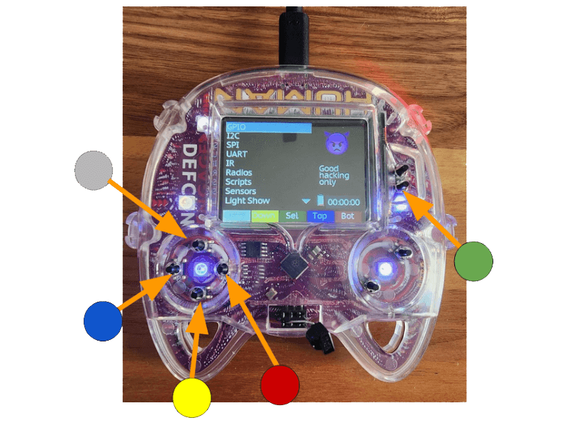
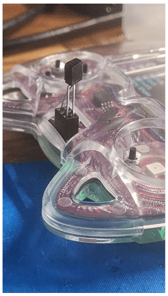
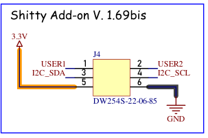
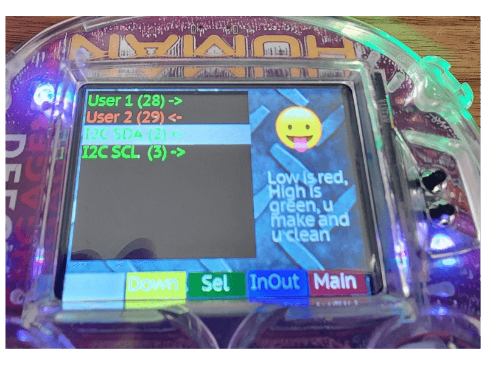

# DEFCON32 Badge Edition

The Defcon32 badge is a device that has similar features to the FREE-WILi hardware. To promote FREE-WILi and make the almost 30,000 badges more useful we have released a version of the FREE-WILi code for it for Free (Use at your own risk).

The I2C support is particular well supported making the DEFCON badge a great development tool for DEFCON SAO add-ins.

<figure>

<figcaption>DEFCON32 Badge with button map.</figcaption>
</figure>

## Features of FREE-WILi Supported

The badge does not contain all hardware in FREE-WILi but it does support a significant amount:

* Screen
* Buttons
* Accelerometer
* LEDs, light show with up to one LED light strip
* IR Transmission
* IR Reception with addition of one sensor
* I2C control
* GPIO control of USER1, USER2, and SAO pins
* Sound board with integrated buzzer
* USB Serial Console Terminal
* WASM Scripting with ROM images

## Loading FREE-WILi Software

You can load the FREE-WILi uf2 by forcing the badge into the RP2350 boot loader. This is done by holding both the reset and the bootload button down and then releasing the reset. The reset and boot load buttons are on the back of back shown below.

After doing this the badge will present itself as a mass storage device (USB drive). Simple copy over the `FreeWilliDefconVX.uf2` file to the drive. It will reset when it is complete flashing.

<figure>

<figcaption>Booting new firmware into The Defcon32 badge.</figcaption>
</figure>

## Using The IR receive function

The badge has an IRDa sensor. This is not directly compatible with IR Remote devices (although IR Transmit works). To use the FREE-WILi IR features you can add an IRSensor to the SAO connector as shown below. The output of the sensor must be connected to USER 1 as shown.

<figure>

<figcaption>Addition of an IR Sensor to the SAO connector.</figcaption>
</figure>

The recommend and tested sensor is the TSOP38238. It is available from Digikey

import Card from '@site/src/components/Card'; 

<Card 
  title="TSOP38238 | DigiKey Electronics"
  description="DigiKey Electronics"
  link="https://www.digikey.com/en/products/detail/vishay-semiconductor-opto-division/TSOP38238/1681362" 
  imageUrl="https://www.digikey.com/-/media/Images/Favicons/DigiKey_App_Icon_32x32_rgb.svg"
/>

## The SAO Connector

The badge has a SAO connector. This is a DEFCON standard IO connector for expansion. The connector has 4 GPIO of which two can be used as I2C. SAO pin in the lower left corner. Please note the I2C pins have pull up resistors. Also, the badge has 3 devices (touch screen, accel, rtc) already connected to the i2c.

<figure>

<figcaption>The SAO pins with pin 1 in the lower left corner.</figcaption>
</figure>

The schematic of the badge SAO connector is below.

<figure>

<figcaption>The connections on the SAO connector.</figcaption>
</figure>

FREE-WILi allows you to use these as i2c, PWM, IR Rx, GPIO or LED light strip control.

<figure>

<figcaption>The GPIO view will allow you to manual control your SAO.</figcaption>
</figure>

## WASM Scripting

The FREE-WILi badge firmware does not support the touch screen or RTC devices on the badge. This is a great use for WASM scripting. You can write WASM scripts that send and received I2C data. 

