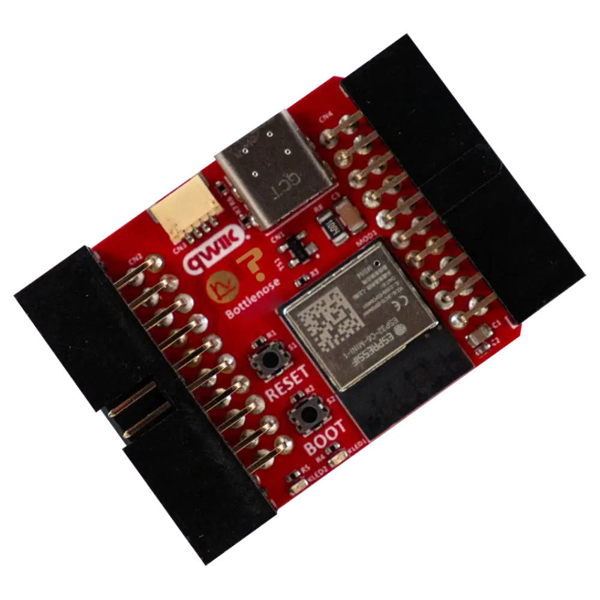

# Bottlenose WiFi Orca

The Bottlenose WiFi Orca is a compact ESP32-C6 development board featuring dual-mode Wi-Fi, Bluetooth, USB-C, and a Qwiic connector for advanced IoT prototyping.

<figure>

<figcaption>Bottlenose WiFi Orca Module</figcaption>
</figure>

### Features

- 2.4GHz Dual Mode WiFi + Bluetooth Development Board (ESP32-C6)
- Support LWIP protocol, FreeRTOS
- Support Three Modes: AP, STA, and AP+STA
- Ultra-Low power consumption
- ESP32 is a safe, reliable, and scalable to a variety of applications
- USB Type C for Debug and Host Mode
- I2C Connect
- Prototyping connectors for I2C (QWIIC)
- LEDs which display IO status
- Standard ESP32 BOOT & RESET Buttons for easy debugging / Programming