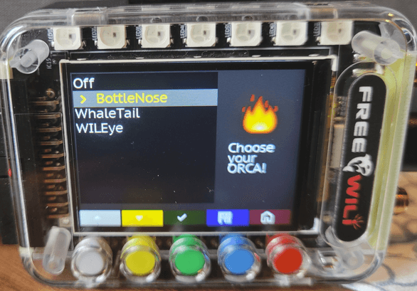
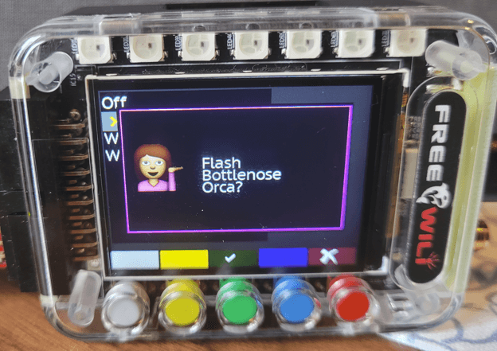
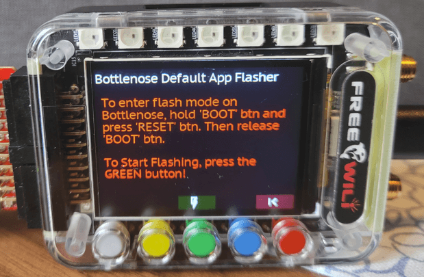
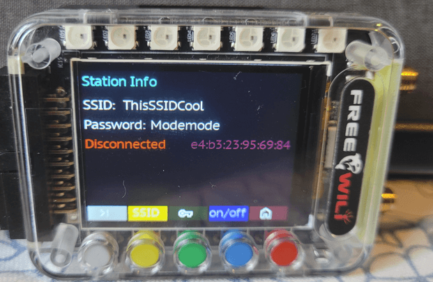
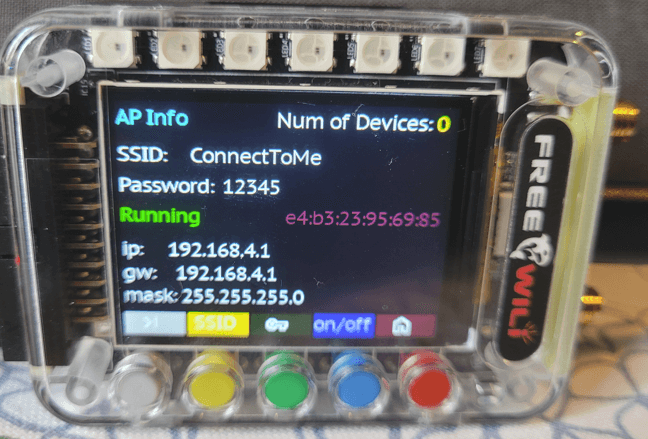

# Bottlenose Getting Started Guide

This guide will walk you through your first project: connecting to WiFi, sending data, and communicating with FREE-WILi.

## Prerequisites

Before starting, make sure you have:
- Bottlenose WiFi Orca properly connected to FREE-WILi (see [Hardware Hookup](/extending-with-orcas/bottlenose-wifi-orca/bottlenose-hardware-hookup/))
- FREE-WILi device with latest firmware installed
- Computer connected to FREE-WILi (via USB or network)
- **UART Orca Communication enabled** for Bottlenose (see Step 1 below)

:::warning UART Communication Required
**CRITICAL**: You must enable UART Orca Communication for Bottlenose in FREE-WILi settings before the module will function. Bottlenose will not work without this setting enabled.
:::

---

## Step 1: Enable UART Orca Communication

Before flashing firmware or using Bottlenose, you must first enable UART Orca Communication in FREE-WILi settings.

:::tip UART Parameters Auto-Configuration
When you enable Bottlenose Communication in Orca Setup, FREE-WILi automatically configures the required UART parameters:
- **Baud Rate**: 3 Mbps
- **Flow Control**: CTS and RTS enabled (Hardware flow control)
- **Data Bits**: 8
- **Stop Bits**: 1
- **Parity**: None

Hardware flow control ensures reliable high-speed data transmission between FREE-WILi and WILEYE, preventing data loss during image transfers.
:::

You can enable FREE-WILEye Uart Comms either through FREE-WILi Main's USB console or through the FREE-WILi's UI panel. We will be covering both methods below.


### Enabling Bottlenose Orca comm via USB Console

1. **Open up the COM port** related to FREE-WILi's Main cpu either by Putty, your favtior serial port monitor, or through FREE-WILi GUI.

2. **Naviagate** to the Orca Setup Settings in Settings: (z\o)

```
Settings
h) SPI
l) I2C
g) UART
f) FPGA
r) Radio 1
m) Radio 2
y) Radio Frequency Analyzer
d) GPIO Directions
a) NeoPixel Light Show
t) RTC
w) Wifi
c) BT
j) Websocket Server
o) Orca Setup
k) Default Script []
i) Default FPGA []
s) Save Settings as Startup
n) Software Reset
b) Software Reset To Bootloader
z) Set settings to default
Enter Letter: (q to exit) 
o

 ========  Configure Orca Communication ========
u) Orca Com over UART [WILEye]
Enter Letter: (q to exit) 
```

3. **Press 'u'** to configure UART communication

```
u
 ========  Configure Orca Communication ========
0) Off
1) BottleNose
2) WhaleTail
3) WILEye
Orca Com over UART Enter Number [1]
```

4. **Select Bottlenose option** from the menu (option 1)

:::tip Automatic Configuration
When you enable Bottlenose Communication, FREE-WILi automatically sets the correct UART parameters, so you don't need to configure them manually!
:::

5. **Verify** that the Orca Communication over Uart is set to [Bottlenose] ✅

:::tip Saving Orca Selection on startup via Console
   To ensure the WILEye Orca setting is presistant the next time FREE-WIli is powerd up, make sure you save the settings. You can do this by naviagating to the main settings menu in Main (z) follow by running the command `Save Settings as Startup`
:::

### Enabling WILEye Orca Communication via FREE-WILi's UI

1. **Go to** the Main Menu page on FREE-WILi and then navigate to System -> Orca Setup. Then press the green button to enter.


2. **Scroll down** untill you reach the Bottlenose option, then press the Green button to enable.


3. **Go back to the Main Menu** by pressing the RED button.

:::tip Saving Orca Selection on startup via UI
   If you want your Orca selection to be presistant, click the blue button to save.
:::

:::tip Flash Bottlense Orca Prompt
   You have the option to flash the default firmware for BottleNose right through this dialog.! If you click yet to this popup, the Bottlenose flasher menu will be displayed. Follow the steps to start flashing the default firmware. We also have the steps listed right down below.
:::

## Step 2: Flash Bottlenose Firmware

Before you can use Bottlenose with FREE-WILi, you need to flash the proper firmware to the ESP32-C6. The Bottlenose firmware is built into the FREE-WILi firmware and can be flashed directly from FREE-WILi.

1. **Locate Control Buttons**:
   On the Bottlenose PCB, you'll find two buttons:
   - **"BOOT" button** - Used to enter bootloader mode
   - **"RESET" button** - Used to reset the ESP32-C6

:::tip Button Location
The BOOT and RESET buttons are typically located near the ESP32-C6 chip on the Bottlenose PCB. Look for small tactile buttons labeled "BOOT" and "RST" or "RESET".
:::

:::tip Use Small Tools for Button Pressing
The BOOT and RESET buttons are very small and can be difficult to press accurately with fingers. For easier and more precise button pressing, use:
- **Tweezers** (plastic or metal)
- **Small screwdriver** (non-conductive preferred)
- **Pen tip** or **pencil eraser**
- **Toothpick** or similar small pointed tool

This ensures you press the correct button without accidentally pressing adjacent components.
:::

2. **Enter Bootloader Mode**:
   The ESP32-C6 must be in bootloader mode to receive firmware from FREE-WILi:
   
   **Step-by-step process:**
   1. **Hold down** the **"BOOT"** button and keep it pressed
   2. While holding BOOT, **press and release** the **"RESET"** button (quick tap)
   3. **Release** the **"BOOT"** button
   
   ✅ The ESP32-C6 is now in bootloader mode and ready to receive firmware

:::warning Important Timing
Make sure to hold the BOOT button BEFORE pressing RESET, and only release BOOT after you've released RESET. This timing is critical for entering bootloader mode correctly.
:::

### Method A: Flash via USB Console App

1. **Connect to FREE-WILi via USB** and open your serial terminal application

2. **Navigate to ESP32 Flasher Menu**:
   ```
   Main Menu → Extended Menus (e) → Extended Menus (e)
   ```
   - Press `e` to enter Extended Menus
   - Press `e` again to access the ESP32 Flasher menu

3. **Select Bottlenose Firmware**:
   - In the ESP32 Flasher menu, press `n` to select the option for flashing Bottlenose firmware
   - You should see: "Flash Bottlenose WiFi Orca Firmware"

4. **Initiate Flashing**:
   - Follow the on-screen prompts
   - The console will show flashing progress
   - Wait for "Flashing Complete" message

**Expected Console Output:**
```
ESP32 Flasher Menu
==================
n) Flash Bottlenose WiFi Orca Firmware
x) Return to Main Menu

Selection: n

[FLASHER] Detecting ESP32-C6 in bootloader mode...
[FLASHER] ESP32-C6 detected successfully
[FLASHER] Starting firmware flash...
[FLASHER] Writing bootloader... [████████████████] 100%
[FLASHER] Writing application... [████████████████] 100%
[FLASHER] Writing partitions... [████████████████] 100%
[FLASHER] Flashing completed successfully!
[FLASHER] Resetting ESP32-C6...
```

### Method B: Flash via FREE-WILi UI Orca Setup Dialog

1. **Select Bottlenose in the Orca Setup Panel**:



2. **Click Yes to `Flash Bottlenose Orca`**:



3. **Follow the prompts to setup Bottlenose into Bootloader mode if you haven't already done so**:



4. **Flash Firmware**:

5. **Monitor Progress**:
   - The interface will show a progress bar during flashing
   - Wait for the "Flashing Complete" confirmation message


5. **Click the `RESET` button on Bottlenose to lauch default application**:

### Troubleshooting Firmware Flashing

#### Common Issues:

**Problem**: "ESP32-C6 not detected in bootloader mode"
- **Solution**: Repeat the bootloader entry process
- **Check**: Ensure BOOT button timing is correct (hold BOOT, tap RESET, release BOOT)
- **Verify**: Bottlenose is properly connected to FREE-WILi with power

**Problem**: "Flashing failed" or "Connection timeout"
- **Solution**: 
  1. Reset both FREE-WILi and Bottlenose
  2. Retry entering bootloader mode
  3. Attempt flashing again

**Problem**: Flashing appears successful but module doesn't work
- **Solution**: 
  1. Perform a hard reset: hold RESET button for 5 seconds
  2. Check hardware connections
  3. Try flashing again

:::note Firmware Updates
The Bottlenose firmware embedded in FREE-WILi may be updated with new FREE-WILi firmware releases. Check for FREE-WILi updates periodically to get the latest Bottlenose features and improvements.
:::

### Understanding the Default Bottlenose Application

Once firmware is flashed successfully, Bottlenose runs a default application that provides several key networking and communication features:

#### Core Functionality
The default Bottlenose app is designed to extend FREE-WILi's connectivity options:

- **🌐 WebSocket Terminal Bridge** - Bridges FREE-WILi's main terminal over WebSocket connections
- **📱 Bt Terminal Bridge** - Provides terminal access via Bt Low Energy
- **📡 WiFi Network Scanner** - Scans for available WiFi access points
- **🔍 Bt Device Scanner** - Discovers nearby Bt devices
- **💻 HTTP Web Browser Interface** - Hosts a web server for browser-based terminal access. Accessable at port 8080

#### Default App Benefits
- **Remote Access**: Control FREE-WILi wirelessly through WiFi or Bt
- **Web Integration**: Access FREE-WILi terminal from any web browser
- **Network Discovery**: Find and connect to available networks
- **Cross-Platform**: Works with phones, tablets, laptops, and other devices

#### Typical Usage Scenarios
- **Wireless Debugging**: Access FREE-WILi terminal without USB cable
- **Remote Configuration**: Configure settings from across the room
- **Multiple Users**: Share access through web interface
- **Mobile Integration**: Control FREE-WILi from smartphone or tablet
- **Network Troubleshooting**: Scan and analyze WiFi/Bt environments

---

## Step 3: Configure Bottlenose Settings

Before using Bottlenose functionality, you need to configure the networking and communication settings through FREE-WILi's configuration system.

### Accessing Configuration Settings

1. **Connect to FREE-WILi** via USB console or web interface
2. **Navigate to Settings** menu
3. **Find Bottlenose configuration sections**: WiFi, Bt, and WebSocket Server

### WiFi Configuration

Configure Bottlenose WiFi functionality through the WiFi settings menu:

```
========  Configure Wifi  ========

s) Enable Wifi Station Mode [off]
d) SSID for Wifi Station Mode []
p) Password for Wifi Station Mode []
a) Enable Access Point Mode [off]
u) Access Point Authentication [open]
h) Access Point hide SSID [visible]
g) SSID for Access Point []
x) Password for Access Point []
```

#### WiFi Settings Explained:

**Station Mode Settings:**
- `s)` **Enable Wifi Station Mode** - Connect Bottlenose to existing WiFi network
- `d)` **SSID for Station Mode** - Network name to connect to
- `p)` **Password for Station Mode** - Network password (leave blank for open networks)

**Access Point Mode Settings:**
- `a)` **Enable Access Point Mode** - Create WiFi hotspot using Bottlenose
- `u)` **Access Point Authentication** - Security type (open/WPA2/WPA3)
- `h)` **Access Point Hide SSID** - Make hotspot visible or hidden
- `g)` **SSID for Access Point** - Hotspot name (e.g., "My_AP")
- `x)` **Password for Access Point** - Hotspot password (8+ characters for secured networks)

#### WiFi Configuration Example:
```
Configure WiFi for home network connection:
s) Enable Wifi Station Mode [on]
d) SSID for Wifi Station Mode [MyHomeWiFi]
p) Password for Wifi Station Mode [mypassword123]
a) Enable Access Point Mode [off]

Or configure as mobile hotspot:
s) Enable Wifi Station Mode [off]
a) Enable Access Point Mode [on]
u) Access Point Authentication [WPA2]
h) Access Point hide SSID [visible]
g) SSID for Access Point [Bottlenose_Mobile]
x) Password for Access Point [mobile123secure]
```

### Bt Configuration

Configure Bottlenose Bt functionality:

```
========  Configure BT  ========

s) Enable BT [off]
t) BT Terminal Bridge [off]
a) BT Advertising Name []
```

#### Bt Settings Explained:

- `s)` **Enable BT** - Turn on Bt Low Energy functionality
- `t)` **BT Terminal Bridge** - Enable terminal access via Bt connections
- `a)` **BT Advertising Name** - Device name visible to other Bt devices

#### Bt Configuration Example:
```
Enable Bt with terminal access:
s) Enable BT [on]
t) BT Terminal Bridge [on]
a) BT Advertising Name [Bottlenose_Terminal_01]
```

:::tip Bt Device Names
Choose descriptive names for easy identification when multiple Bottlenose devices are nearby. Include location or purpose in the name (e.g., "Lab_Bottlenose", "Mobile_Unit_A").
:::

### WebSocket Server Configuration

Configure the web-based terminal access:

```
========  Websocket Server Configuration ========

r) Start Websocket Server [on]
p) Websocket Server Port [8765]
m) Authentication Mode [open]
u) Authentication Username []
d) Authentication Password []
```

#### WebSocket Settings Explained:

- `r)` **Start Websocket Server** - Enable web-based terminal access
- `p)` **Websocket Server Port** - TCP port for web connections (default: 8765)
- `m)` **Authentication Mode** - Security level (open/password-protected)
- `u)` **Authentication Username** - Login username (if authentication enabled)
- `d)` **Authentication Password** - Login password (if authentication enabled)

#### WebSocket Configuration Examples:

**Open Access (No Authentication):**
```
r) Start Websocket Server [on]
p) Websocket Server Port [8765]
m) Authentication Mode [open]
```

**Secure Access (Password Protected):**
```
r) Start Websocket Server [on]
p) Websocket Server Port [8765]
m) Authentication Mode [password]
u) Authentication Username [admin]
d) Authentication Password [secure123]
```

#### Access Your Configured Bottlenose:

**Via Web Browser:**
- Connect to same WiFi network as Bottlenose
- Navigate to: `http://<bottlenose-ip>:8765`
- Use authentication credentials if configured
- Navigate to: `http://<bottlenose-ip>:8080` to access HTTP Websocket terminal 

**Via Bt:**
- Scan for Bt devices
- Connect to your configured device name
- Access terminal through BLE app

**Via WiFi Hotspot:**
- Connect device to Bottlenose AP
- Navigate to: `http://192.168.4.1:8765`
- Access terminal interface

---

### Access Bottlenose Features through FREE-WILi's UI

#### Wireless Wifi Menu

##### Station Menu

You can set SSID, password, and enable/disable Bottlenose's station mode.

The IP, Mask, and Gateway of Bottlenose values are reported here along with the MAC address for Bottlenose.



##### Acess Point Menu

You can set SSID, password, and enable/disable Bottlenose's access point mode.

The IP, Mask, and Gateway value for Bottlenoe's AP are reported here along with the MAC address for Bottlenose.




## Step 4: Create Your Own Custom Firmware for Bottlenose

You can create your own firmware for Bottlenose to do custom tasks using Espressif's ESP-IDF development framework. This allows you to build specialized applications that leverage the ESP32-C6's WiFi and processing capabilities while communicating with FREE-WILi through custom protocols.

### Development Framework Options

**ESP-IDF (Recommended)**: Espressif's official development framework provides full access to ESP32-C6 hardware features and advanced networking capabilities.

**Arduino IDE**: Easier entry point for beginners, but with some limitations on advanced features.

**Custom Protocol Communication**: You can create your own UART communication protocol between Bottlenose and FREE-WILi, giving you complete control over data exchange.

:::warning Disable Orca Communication for Custom Protocols
**IMPORTANT**: If you plan to send your own UART packets between Bottlenose and FREE-WILi, you **MUST** disable Orca Communication in FREE-WILi settings first. The default Bottlenose protocol and your custom protocol cannot run simultaneously on the same UART channel.

To disable: Go to FREE-WILi Settings → Orca Setup → Set "Orca Com over UART" to "Off"
:::

### Custom Firmware Use Cases

- **IoT Sensor Networks**: Create specialized sensor data collection and transmission
- **Custom Web Services**: Build tailored web servers and APIs for your specific needs  
- **Protocol Bridges**: Interface FREE-WILi with other systems using custom communication protocols
- **Real-time Data Processing**: Implement time-sensitive applications with direct hardware control
- **Wireless Debugging Tools**: Create custom debugging and diagnostic interfaces

### Going Further with Custom Bottlenose Apps

For advanced users who want to develop custom applications beyond the default firmware, you can program the Bottlenose ESP32-C6 directly using standard ESP32 development tools and frameworks.

#### Development Environment Setup

Choose your preferred development environment and follow the official setup guides:

**Arduino IDE (Easier for Beginners):**
- **Arduino ESP32 Getting Started**: [https://docs.espressif.com/projects/arduino-esp32/en/latest/installing.html](https://docs.espressif.com/projects/arduino-esp32/en/latest/installing.html)
- **ESP32-C6 Arduino Support**: [https://docs.espressif.com/projects/arduino-esp32/en/latest/](https://docs.espressif.com/projects/arduino-esp32/en/latest/)
- Board package URL: `https://espressif.github.io/arduino-esp32/package_esp32_index.json`
- Select **"ESP32C6 Dev Module"** as target board

**ESP-IDF (Recommended for Advanced Features):**
- **Official ESP-IDF Getting Started Guide**: [https://docs.espressif.com/projects/esp-idf/en/latest/esp32c6/get-started/](https://docs.espressif.com/projects/esp-idf/en/latest/esp32c6/get-started/)
- **ESP32-C6 Specific Documentation**: [https://docs.espressif.com/projects/esp-idf/en/latest/esp32c6/](https://docs.espressif.com/projects/esp-idf/en/latest/esp32c6/)
- Provides full access to ESP32-C6 hardware features and advanced networking capabilities

**PlatformIO (Professional IDE):**
- **PlatformIO ESP32 Platform**: [https://docs.platformio.org/en/latest/platforms/espressif32.html](https://docs.platformio.org/en/latest/platforms/espressif32.html)
- **ESP32-C6 Board Configuration**: Use board ID `esp32-c6-devkitc-1`

#### Programming and Debugging via USB-C

The Bottlenose includes a USB-C connector that provides direct access to the ESP32-C6 for programming and debugging:

**Power Requirements:**
- **Bottlenose must be connected to FREE-WILi** for power during programming
- **USB-C port is data-only** - does not provide power to the ESP32-C6
- Keep FREE-WILi powered on during all programming operations

**Programming Workflow:**
1. Connect Bottlenose to FREE-WILi via Orca connector (for power)
2. Connect USB-C cable from computer to Bottlenose
3. Use standard ESP32 development tools (ESP-IDF, Arduino IDE, PlatformIO)
4. Flash and debug your custom firmware directly

#### Custom Protocol Development

When developing custom firmware, you have full control over the UART communication between Bottlenose and FREE-WILi.

:::tip Development Resources
- **ESP32-C6 Hardware Reference**: [https://www.espressif.com/sites/default/files/documentation/esp32-c6_datasheet_en.pdf](https://www.espressif.com/sites/default/files/documentation/esp32-c6_datasheet_en.pdf)
- **ESP-IDF Programming Guide**: [https://docs.espressif.com/projects/esp-idf/en/latest/esp32c6/api-guides/](https://docs.espressif.com/projects/esp-idf/en/latest/esp32c6/api-guides/)
- **Arduino ESP32 Examples**: [https://github.com/espressif/arduino-esp32/tree/master/libraries](https://github.com/espressif/arduino-esp32/tree/master/libraries)
- **Community Forums**: [https://www.esp32.com/](https://www.esp32.com/) for community support and examples
:::

---

### Development Resources

- **ESP32-C6 Documentation**: [Espressif ESP32-C6 Docs](https://docs.espressif.com/projects/esp-idf/en/latest/esp32c6/)

**Happy coding!** Your Bottlenose WiFi Orca is now ready to use!