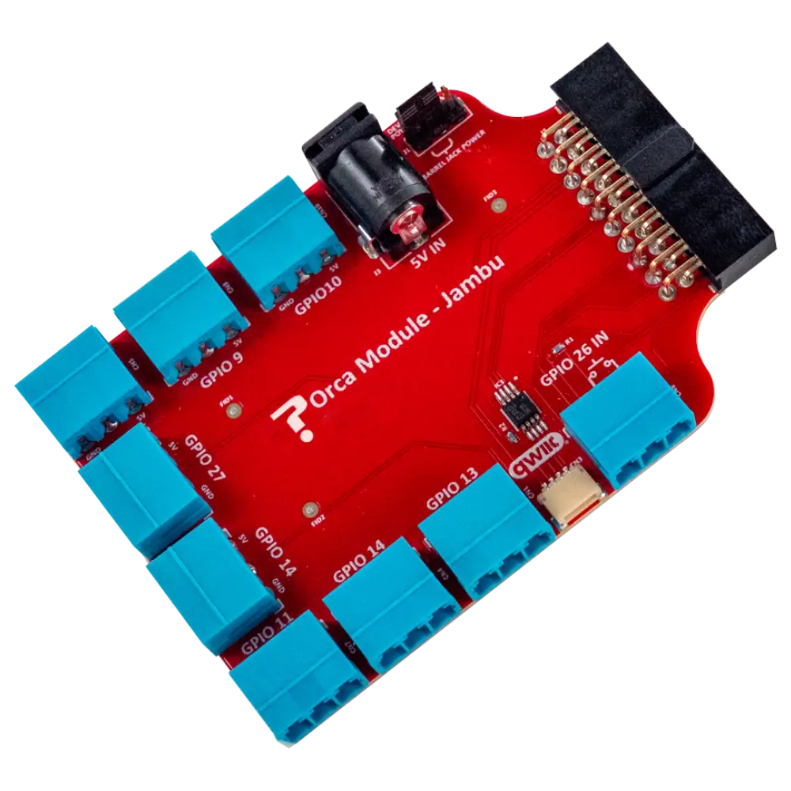

# Jambu Serial LED Control Orca

The Jambu Serial LED Control Orca is a compact and powerful 8-channel LED driver breakout module designed to bring dynamic lighting to your projects.

<figure>

<figcaption>Jambu Serial LED Control Orca Module</figcaption>
</figure>

### Features

- 8-channel LED Driver Breakout
- Control 8 LED Strips 
- 5V Barrel Jack Power
- Suitable for common anode Serial RGB LED strips, LEDs and Incandescent bulbs 
- Two-Wire I2C-Compatible Control Interface
- Prototyping connectors for I2C (QWIIC)
