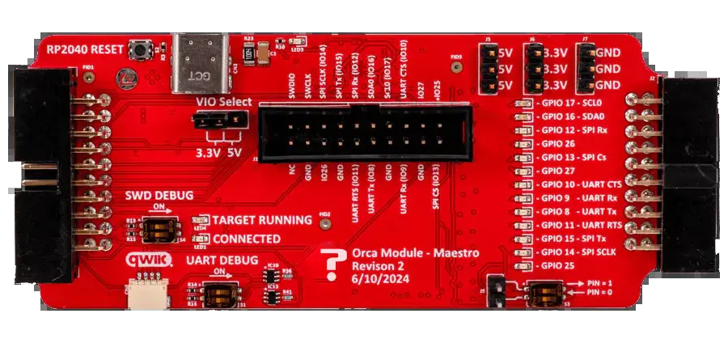

# Maestro Debug Orca

The Maestro Orca is a trouble shooting and development tool for FREE-WILi. The board consists of a USB debugger for the RP2040 main controller and IO test points.

<figure>

<figcaption>Maestro Orca Module</figcaption>
</figure>

## Features

- Integrated Raspberry Pi Debug Probe [https://www.raspberrypi.com/documentation/microcontrollers/debug-probe.html](https://www.raspberrypi.com/documentation/microcontrollers/debug-probe.html)
- Pico scope Logic Analyzer Connector [https://www.picotech.com/oscilloscope/2000/picoscope-2000-overview](https://www.picotech.com/oscilloscope/2000/picoscope-2000-overview)
- LEDs which display IO status
- Switches to test GPIOs that are inputs
- Prototyping connectors for I2C (QWIIC) and SDCARDs.
- Jumper for selecting or injecting IO voltage
- Connector for plugging in additional Orca modules

## Schematic

import Card from '@site/src/components/Card';

<!-- <Card 
  title="OrcaModule_Monstro.pdf"
  description="pdf"
  link="/downloads/OrcaModule_Monstro.pdf" 
  imageUrl="/img/png-download.png"
/> -->

## Useful tools

Jumper wires

<Card 
  title="ELEGOO Breadbord Jumper Wires"
  description="Amazon.com"
  link="https://www.amazon.com/Elegoo-EL-CP-004-Multicolored-Breadboard-arduino/dp/B01EV70C78/" 
  imageUrl="/img/amazon.ico"
/>