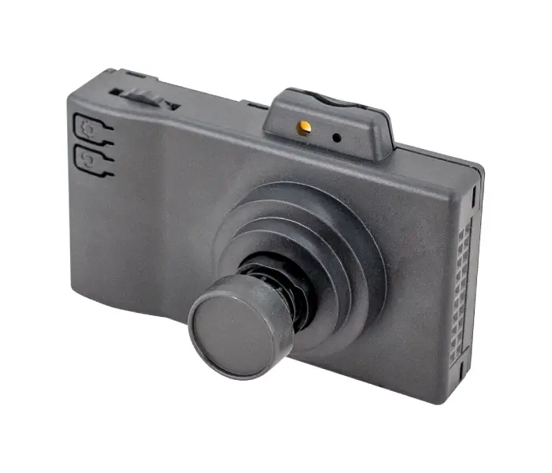

# WILEYE Camera Orca
> The Vision Accessory for FREE-WILi Orca Modules

<figure>

<figcaption>WILEYE Camera Orca Module</figcaption>
</figure>

Take your FREE-WILi development further with WILEYE, a compact camera accessory engineered for makers, hardware hackers, and embedded developers. Designed around the ESP32-P4 SoC and built to integrate seamlessly with Orca modules, WILEYE adds vision, debugging, and interactive control to your toolkit.

## Features

- Plug-and-play programming & debugging via USB JTAG
- Real-time image capture for robotics, IoT & RF projects
- On-device LCD for logs, status & previews
- MicroSD logging for field experiments
- Tripod/enclosure mounting for flexible setups
- Built to extend FREE-WILi Orca ecosystem
- ESP32-P4 Dual-core RISC-V SoC
- 32MB PSRAM, 16MB Flash, MicroSD support
- 2MP MIPI-CSI camera, manual focus + software zoom
- 1.54″ SPI LCD, 240×240 resolution
- USB 2.0 HS + USB Serial JTAG
- 1/4″ screw mount