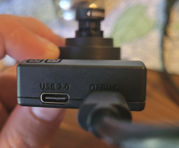
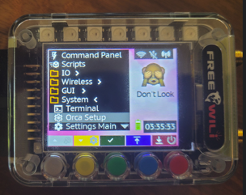
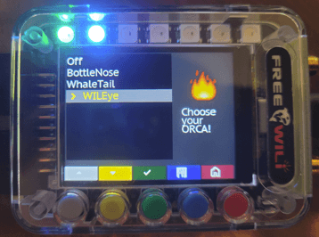
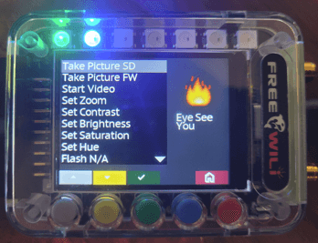

# WILEYE Flashing WILEye Orca Firmware onto ESP32-P4-EYE

Before we can have the FREE-WILi control the WILEye, we will need to custome firmware onto the ESP32-P4-EYE device. This guide will walk you through how to flash the custom firmware over the ESP32-P4-EYE's USB JTAG port.

## Prerequisites

Before starting, make sure you have:
- WILEYE Camera Orca properly connected to FREE-WILi (see [Hardware Hookup](/extending-with-orcas/wileye-camera-orca/wileye-hardware-hookup/))
- USB-C cable for programming and power
- Computer with Python installed
- **Python** 3.5 or greaterhttps://www.python.org/downloads/
- **WILEYE firmware files downloaded** from the FREE-WILi Github WILEye repository: **https://github.com/freewili/WILEye-Firmware**
- **Latest ESPTool** from the Espressif's Github **https://github.com/espressif/esptool/releases/tag/v5.1.0**


## Step 1: Install ESPTool and Flash Custom WILEye Firmware onto ESP32-P4-EYE

Before you can use WILEYE with FREE-WILi, you need to flash the proper firmware to the ESP32-P4-EYE module.

### Install ESPTool

First, install the ESPTool utility which is required for flashing ESP32 devices:

#### Windows/Mac/Linux - Install ESPTOOL using Pip
```bash
# Install esptool using pip (recommended)
pip install esptool
```

#### Downloading the ESPTool executable

**Windows - Using executable:**
1. Download `esptool.exe` from [GitHub releases](https://github.com/espressif/esptool/releases)
2. Place it in a folder in your PATH

**Linux - Using package manager:**
```bash
# Ubuntu/Debian
sudo apt install esptool

# Fedora
sudo dnf install esptool
```
**Alternatily you can use the ESPTool python module**
```
python -m pip install esptool
```

### Download WILEYE Firmware

**Download the latest WILEye's firmware binary files from the FREE-WILi's Github:**

🔗 **https://github.com/freewili/WILEye-Firmware**

:::tip FREE-WILEye Firmware
This repository contains the pre-compiled binary files needed to update your ESP32-P4-EYE firmware. Download the `.bin` files for flashing to your WILEYE module.
:::

1. **Navigate to the GitHub repository** and download the latest release or binary files
2. **Look for the pre-compiled binary files** (`.bin` files) needed for ESP32-P4-EYE:
   - `bootloader.bin` - ESP32-P4 bootloader
   - `wileye_app_demo.bin` - Espressif's ESP32-P4-EYE factory-demo firmware with FREE-WILi support over Serial.
   - `partition-table.bin` - Memory partition configuration

3. **Create a firmware folder** on your computer and place all binary files inside:
   ```
   wileye-firmware/
   ├── bootloader.bin
   ├── wileye_app_demo.bin
   └── partition-table.bin
   ```

For advanced users who want to modify or build custom firmware, refer to the ESP32-P4-EYE hardware documentation: https://docs.espressif.com/projects/esp-dev-kits/en/latest/esp32p4/esp32-p4-eye/index.html
:::

### Connect WILEYE for Programming

1. **Connect USB-C cable** from your computer to the ESP32-P4-EYE USB port labled as "Debug". Make sure the ESP32-P4-EYE's power switch is set to the "I" position



2. **Note your COM port** - you'll need this for the flashing command (e.g., COM12, /dev/ttyUSB0)

### Flash the Firmware

Navigate to your firmware folder in the command prompt/terminal and run the flashing command:

#### Windows Example:
```bash
cd C:\path\to\wileye-firmware
esptool.exe -p COM12 -b 460800 --before default_reset --after hard_reset --chip esp32p4 write_flash --flash_mode dio --flash_freq 80m --flash_size 16MB 0x2000 bootloader.bin 0x10000 wileye_app_demo.bin 0x8000 partition-table.bin
```

#### Mac/Linux Example:
```bash
cd /path/to/wileye-firmware
esptool -p /dev/ttyUSB0 -b 460800 --before default_reset --after hard_reset --chip esp32p4 write_flash --flash_mode dio --flash_freq 80m --flash_size 16MB 0x2000 bootloader.bin 0x10000 factory_demo.bin 0x8000 partition-table.bin
```

#### ESPTool Python Example:
```bash
cd /path/to/wileye-firmware
python esptool.py -p /dev/ttyUSB0 -b 460800 --before default_reset --after hard_reset --chip esp32p4 write_flash --flash_mode dio --flash_freq 80m --flash_size 16MB 0x2000 bootloader.bin 0x10000 factory_demo.bin 0x8000 partition-table.bin
```


### Expected Output

You should see output similar to this:

```
esptool.py v4.6
Serial port COM12
Connecting.....
Chip is ESP32-P4 (revision v0.1)
Features: WiFi, BT, Dual Core, 400MHz, VRef calibration in efuse, Coding Scheme None
Crystal is 40MHz
MAC: 24:6f:28:xx:xx:xx
Uploading stub...
Running stub...
Stub running...
Changing baud rate to 460800
Changed.
Configuring flash size...
Flash will be erased from 0x00002000 to 0x00005fff...
Flash will be erased from 0x00010000 to 0x001fffff...
Flash will be erased from 0x00008000 to 0x00008fff...
Compressed 15856 bytes to 9976...
Wrote 15856 bytes (9976 compressed) at 0x00002000 in 0.4 seconds...
Hash of data verified.
Compressed 2027520 bytes to 1285632...
Wrote 2027520 bytes (1285632 compressed) at 0x00010000 in 31.5 seconds...
Hash of data verified.
Compressed 3072 bytes to 136...
Wrote 3072 bytes (136 compressed) at 0x00008000 in 0.1 seconds...
Hash of data verified.

Leaving...
Hard resetting via RTS pin...
```

### Troubleshooting Firmware Flash

#### Common Issues and Solutions

**Problem**: "Failed to connect to ESP32"
# Solution 1: Try different baud rate
```bash
python esptool.py -p COM12 -b 115200 --chip esp32p4 chip_id
```
# Solution 2: Verify that the Power switch on the ESP32-P4-EYE board is turned on

**Problem**: "File not found" errors
```bash
# Make sure you're in the correct directory
pwd  # Check current directory
ls   # List files (Linux/Mac)
dir  # List files (Windows)

# Files should be in current directory:
# bootloader.bin, factory_demo.bin, partition-table.bin
```

## Step 2: Enable UART Orca Communication On FREE-WILi

Now that the ESP32-P4-EYE is running modified demo code with FREE-WILEye support, we can now move on to setting up the FREE-WILi to communicate to the FREE-WILEye.

:::tip UART Parameters Auto-Configuration
When you enable WILEYE Communication in Orca Setup, FREE-WILi automatically configures the required UART parameters:
- **Baud Rate**: 5 Mbps
- **Flow Control**: CTS and RTS enabled (Hardware flow control)
- **Data Bits**: 8
- **Stop Bits**: 1
- **Parity**: None

Hardware flow control ensures reliable high-speed data transmission between FREE-WILi and WILEYE, preventing data loss during image transfers.
:::

You can enable FREE-WILEye Uart Comms either through FREE-WILi Main's USB console or through the FREE-WILi's UI panel. We will be covering both methods below.


### Enabling WILEye Orca comm via USB Console

1. **Open up the COM port** related to FREE-WILi's Main cpu either by Putty, your favtior serial port monitor, or through FREE-WILi GUI.

2. **Naviagate** to the Orca Setup Settings in Settings: (z\o)

```
Settings
h) SPI
l) I2C
g) UART
f) FPGA
r) Radio 1
m) Radio 2
y) Radio Frequency Analyzer
d) GPIO Directions
a) NeoPixel Light Show
t) RTC
w) Wifi
c) BT
j) Websocket Server
o) Orca Setup
k) Default Script []
i) Default FPGA []
s) Save Settings as Startup
n) Software Reset
b) Software Reset To Bootloader
z) Set settings to default
Enter Letter: (q to exit) 
o

 ========  Configure Orca Communication ========
u) Orca Com over UART [WILEye]
Enter Letter: (q to exit) 
```

3. **Press 'u'** to configure UART communication

```
u
 ========  Configure Orca Communication ========
0) Off
1) BottleNose
2) WhaleTail
3) WILEye
Orca Com over UART Enter Number [3]
```

4. **Select WILEYE option** from the menu (option 3)

:::tip Automatic Configuration
When you enable WILEYE Communication, FREE-WILi automatically sets the correct UART parameters, so you don't need to configure them manually!
:::

5. **Verify** that the Orca Communication over Uart is set to [WILEye] ✅

:::tip Saving Orca Selection on startup via Console
   To ensure the WILEye Orca setting is presistant the next time FREE-WIli is powerd up, make sure you save the settings. You can do this by naviagating to the main settings menu in Main (z) follow by running the command `Save Settings as Startup`
:::

### Enabling WILEye Orca Communication via FREE-WILi's UI

1. **Go to** the Main Menu page on FREE-WILi and then navigate to System -> Orca Setup. Then press the green button to enter.



2. **Scroll down** untill you reach the WILEye option, then press the Green button to enable.



3. **Go back to the Main Menu** by pressing the RED button.

:::tip Saving Orca Selection on startup via UI
   If you want your Orca selection to be presistant, click the blue button to save.
:::

## Using the FREE-WILEye

At this point, you should be fully setup to interfacing the FREE-WILEye via FREE-WILi!

### Camera Control UI Panel

You can interface with the WILEye on FREE-WILi's UI on the Camera "Commander" panel that can be found in GUI -> Camera from the Main Menu.




### Overview WILEye's Menu in USB Console

WILEye has its own menu under the "Extended Menus" option in Main's USB Console.

```
Extended Functions
====================
m) MDIO Functions
w) Wifi Functions
b) BT Functions
e) ESP32 Flasher Functions
r) ZoomIO
a) Analog In
o) Analog Out
c) WILEye Functions
====================
h) Help
d) Reset To Defaults
z) Fuzzzzzzz
Enter Letter: (q to exit) 
c

WILEye Functions
AI Stream Mode: Off
Recording Video: 0
Streaming Image: 0
====================
t) Take a Picture
v) Start Recording Video
s) Stop Recording Video
a) Stream AI Detection Events
m) Set Zoom
c) Set Contrast
i) Set Saturation
b) Set Brightness
u) Set Hue
y) Set Resolution
l) Enable Disable Flash
====================
h) Help
d) Reset To Defaults
z) Fuzzzzzzz
Enter Letter: (q to exit) 
```


### WILEye API Commands

| Command | Function | Description | Parameters |
|---------|----------|-------------|------------|
| `t` | **Take a Picture** | Captures a single image and saves it based on destination and filename arguments | Destination: `0` = FREE-WILEys's SD card, `1` = Stream Picture to FREE-WILi's File system, filename |
| `v` | **Start Recording Video** | Begins video recording with specified filename | Filename |
| `s` | **Stop Recording Video** | Stops the current video recording | None |
| `a` | **Stream AI Detection Events** | Configures AI event streaming with preset modes | Mode: `0` = Off, `1` = Pedestrian, `2` = Face |
| `m` | **Set Zoom** | Adjusts lens zoom level | Zoom factor: `1-4`x |
| `c` | **Set Contrast** | Adjusts camera contrast | Percentage: `0-100` |
| `i` | **Set Saturation** | Adjusts camera saturation | Percentage: `0-100` |
| `b` | **Set Brightness** | Adjusts camera brightness | Percentage: `0-100` |
| `u` | **Set Hue** | Adjusts camera hue | Percentage: `0-100` |
| `y` | **Set Resolution** | Sets camera resolution to preset values | Mode: `0` = 640×480, `1` = 1280×720, `2` = 1920×1080 |
| `l` | **Enable/Disable Flash** | Controls flash for picture taking | Boolean: `0` = Disable, `1` = Enable |


### Interfacing with WILEye via FREE-WILI's Python API 

WILEye's API is also exposed via FREE-WILi's Python API. The API footprint is the same as the WILEye API listed in the USB console.

You can find an example on how to use the API here: https://github.com/freewili/freewili-python/blob/master/examples/wileye_simple.py 

## Troubleshooting Hardware Issues
 **WILEye API commands are returning Failed**: Verify that the WILEye Camera is in the correct orientation when it is connected to the adpater board and that the Orca Communication over UART is set to `WILEye`. If issue still presists, verify that the UART settings are below for WILEye comm. If the parameters are mismatch, try setting them manually:

| Parameter | Value |
|-----------|-------|
| **Baud Rate** | 5,000,000 bps (5 Mbps) | 
| **Data Bits** | 8 |
| **Stop Bits** | 1 |
| **Parity** | None |
| **Flow Control** | RTS/CTS |

However, if the UART parameters are correct, try rebooting the FREE-WILi and the FREE-WILEYE devices.


## Next Steps

Now that your WILEYE Camera Orca is set up and working:

### Immediate Projects
1. **Time-lapse Photography**: Set up automated captures at intervals
2. **Motion Detection**: Use API to detect movement and trigger recording
4. **Custom Applications**: Build your own camera control software using the WASM API

### Advanced Integration
2. **AI Processing**: Implement image recognition on captured photos
3. **Automation**: Trigger camera based on sensor inputs
4. **Multi-camera Setup**: Coordinate multiple WILEYE modules

### Learning Resources
- [WILEYE Hardware Hookup](/extending-with-orcas/wileye-camera-orca/wileye-hardware-hookup/) - Physical setup and connections
- [Main WILEYE Documentation](/extending-with-orcas/wileye-camera-orca/) - Complete feature overview
- [ESP32-P4-EYE Official Documentation](https://docs.espressif.com/projects/esp-dev-kits/en/latest/esp32p4/esp32-p4-eye/index.html) - Hardware platform details
- [ESP32-P4-EYE GitHub Repository](https://github.com/espressif/esp-dev-kits/tree/master/esp32-p4-eye) - Hardware files and examples
- [Espressif ESP-IDF Programming Guide](https://docs.espressif.com/projects/esp-idf/en/stable/esp32p4/index.html) - Advanced ESP32-P4 programming

## Community and Support

- **FREE-WILi Forum**: Share your camera projects and get help
- **GitHub Examples**: Find sample code and contribute improvements
- **Discord Community**: Real-time chat with other users
- **Documentation**: Keep checking for updates and new features

**Congratulations!** Your WILEYE Camera Orca is now fully integrated with FREE-WILi and ready for your projects! 📸