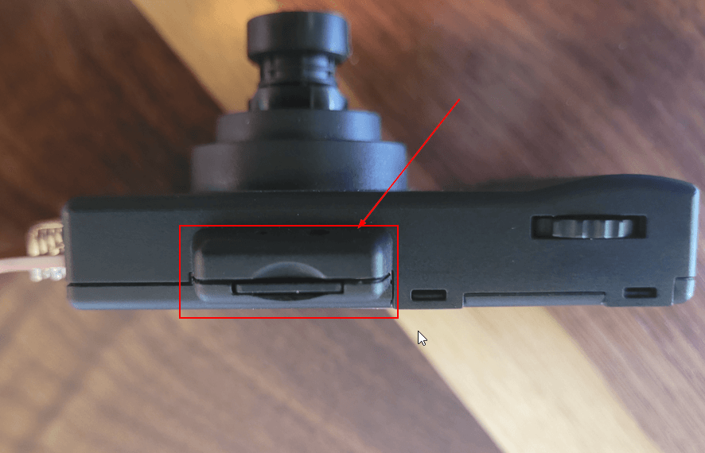
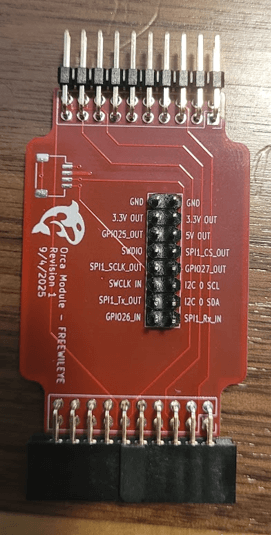

# WILEYE Hardware Hookup Guide

This guide covers the physical setup and connections for the WILEYE Camera Orca module.

## About the WILEye Platform

The WILEYE Camera Orca uses the ESP32-P4-EYE evaluation board from Espressif with custom firmware and an a Adapter that connects the ESP32-P4-EYE to the FREE-WILi. For comprehensive technical documentation about the ESP32-P4-EYE platform, refer to Espressif's documentation:

📖 **ESP32-P4-EYE Official Documentation**: https://docs.espressif.com/projects/esp-dev-kits/en/latest/esp32p4/esp32-p4-eye/index.html

This official documentation provides detailed information about:
- Complete hardware schematics and component layout
- Camera sensor specifications and configuration
- GPIO pin assignments and electrical characteristics
- Power consumption and thermal considerations
- Advanced programming examples and ESP-IDF integration

:::tip Hardware Reference
For advanced users working directly with the ESP32-P4-EYE, the official Espressif documentation is the authoritative source for all hardware specifications and programming details.
:::

## Required Components
- 1 x ESP32-P4-EYE
- 1 x FREE-WIL-EYE Orca module Adapter
- 1 x USB-C cable for programming/power (For flashing the ESP32-P4-EYE with WILEye Orca Firmware)
- 1 x MicroSD card

## Physical Connections

### Connecting to FREE-WILi

1. Power down the FREE-WILi by holding down the RED button for three seconds

2. Connect the FREE-WIL-EYE Orca module Adapter to the ESP32-P4-EYE. The lens should be facing towards you like the image below

:::warning Proper Orientation Required!
**CRITICAL:** The camera lens must be visible on the same side as the FREE-WILi logo on the adapter board. Before connecting the FREE-WIL-EYE Orca adapter to FREE-WILi, verify this alignment to prevent damage. Incorrect orientation may cause a short circuit that could damage both your FREE-WILi and the ESP32-P4-EYE!
:::

3. Connect the FREE-WIL-EYE Orca module Adapter to the FREE-WILi

4. Power up the FREE-WILi by holding down the GREY button for three seconds

5. On the ESP32-P4-EYE, flip over to the side of the device that has the screen and find the power switch on the button right hand corner. Move the switch from the "0" state to the "I" state.

6. The screen on the ESP32-P4-EYE should now be powered up and running the default firmware. 

## MicroSD Card Installation

An MicroSD card can be connected to the ESP-P4-EYE to save videos and pictures. 

:::tip SD Card Recommendations
- Use Class 10 or higher MicroSD cards for optimal performance
- Format the card as FAT32 for best compatibility
- 32GB or smaller cards are recommended for fastest boot times
:::

## GPIO and Expansion

### Communication between ESP32-P4-EYE and FREE-WILi
The FREE-WIL-EYE Orca module Adapter routes UART with hardware handshake lines between ESP32-P4-EYE and FREE-WILi.

#### UART Pinout

| ESP32-P4-EYE Pin | FREE-WILi Pin     | Function                               |
|------------------|-------------------|----------------------------------------|
| ESP_5V           | 5V OUT           | Power Supply (5V)                      |
| GPIO37           | UART1_TX_Out     | Transmit Data (FREE-WILi → ESP32 )      |
| GPIO38           | UART1_RX_IN      | Receive Data (ESP32 → FREE-WILi)       |
| GPIO34           | UART1_CTS_IN     | Clear to Send (Hardware Flow Control)  |
| GPIO51           | UART1_RTS_OUT    | Request to Send (Hardware Flow Control)|
| GND              | GND              | Ground Reference                       |

Both device's UART is configured with the following parameters:
- **5 Mbps Baudrate** - High-speed communication for image/video data
- **CTS and RTS Controls Enabled** - Hardware flow control for reliable transmission
- **8 Data Bits** - Standard data frame size
- **1 Stop Bit** - Standard frame termination
- **No Parity** - Error detection handled at higher protocol levels

:::tip UART parameters on FREE-WILi
FREE-WILi will automatically set the required UART parameters if you enable WILEye Communicaiotn in the Orac Setup Setting. We will be going over that later.
:::

### Additional Exposed Pins

The FREE-WIL-EYE Orca adapter also exposes additional FREE-WILi's IO to allow interfacing with additional interfaces:
- I2C communication (SDA/SCL) over the QWIIC connector
- SPI interface
- Digital I/O pins
- Power (3.3V, 5V, GND)

## Troubleshooting Hardware Issues

### Camera Issues
- **Not Powering up**: Double check orientation of the WILEye Camera to the FREE-WIL-EYE Orca adapter. 

## Next Steps

Once your hardware is connected:
1. Try the [Setup and Interface with the WILEye](/extending-with-orcas/wileye-camera-orca/wileye-Setup-and-Interface)
2. Explore advanced features in the main [WILEYE Camera Orca](/extending-with-orcas/wileye-camera-orca/) documentation

## Additional Resources

For advanced hardware work and custom development:

- 📖 [ESP32-P4-EYE Official Documentation](https://docs.espressif.com/projects/esp-dev-kits/en/latest/esp32p4/esp32-p4-eye/index.html) - Complete hardware specifications
- 🔧 [ESP32-P4-EYE GitHub Repository](https://github.com/espressif/esp-dev-kits/tree/master/esp32-p4-eye) - Schematics and design files  
- 💻 [ESP-IDF Programming Guide](https://docs.espressif.com/projects/esp-idf/en/stable/esp32p4/index.html) - Advanced ESP32-P4 programming
- 📐 [ESP32-P4 Datasheet](https://www.espressif.com/sites/default/files/documentation/esp32-p4_datasheet_en.pdf) - Technical specifications
