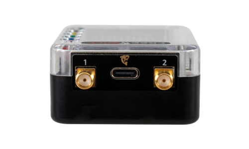

# FREE-WILi Overview

import useBaseUrl from '@docusaurus/useBaseUrl';
import ThemedImage from '@theme/ThemedImage';

<!-- 

<figure>

<figcaption>Make Embedded Systems Fun Again.</figcaption>
</figure>

 -->

<figure>
  <ThemedImage
    alt="FREE-WILi Overview"
    sources={{
      light: useBaseUrl('./img/freewili-overview-light.jpg'),
      dark: useBaseUrl('./img/freewili-overview.jpg'),
    }}
  />
  <figcaption>Make Embedded Systems Fun Again.</figcaption>
</figure>

## Overview

<figure>

<figcaption>FREE-WILi Overview</figcaption>
</figure>

FREE-WILi is a embedded development tool for helping test, debug, and develop electronic systems.

## Use Cases

- I2C USB interface
- SPI USB interface
- UART USB interface
- Generic Digital Protocol development (script protocol)
- USB attached screen and buttons <!-- - Uart based protocol tool support (cxpi, sent, flexwire) -->
- Uart based protocol tool support
- TPMS fuzzer or simulator
- Keyless Entry simulator/monitor
- Cybersecurity penetration testing
- Development platform that 80% done
- Learning platform for Embedded Systems CPU, FPGA or Hybrid
<!-- - TI Wireless Battery Management -->
<!-- - Interface for:
  - 6LoWPAN
  - Amazon Sidewalk
  - IEEE 802.15.4
  - MIOTY
  - Proprietary 2.4 GHz
  - Thread
  - Wi-SUN NWP
  - Wireless M-Bus
  - Zigbee -->
<!-- - Learning platform for Embedded Systems -->

## Software Features

- USB Serial console API to control from host PC without installing any software
- [WASM (webassembly) scripting](/io-app/scripting-with-wasm/) engine with examples for C/C++, Rust, Zig and Tiny Go
- [Host API Python](https://github.com/freewili/freewili-python/) software
- FAT File system 
- Sigrok Pulse view [Logic Analyzer](/io-app/logic-analyzer/) support
- host binary API for Graphical User Interface
- WASM API to control all device features
- [ZoomIO scripting engine](/io-app/scripting-with-zoomio/) controls IO pins with nanosecond precision
- [GUI Software](/gui-screen-buttons-and-lights/) with custom panels and graphical controls
- Integrated [sounds](/gui-screen-buttons-and-lights/making-sounds/) and [images](/gui-screen-buttons-and-lights/displaying-images/) in ROM for enhancing user apps
- [Numbers To Speech](/gui-screen-buttons-and-lights/making-sounds/) feature to speak numbers
- File formats compatible with existing market devices
- Standard [USB boot-loader](/freewili-firmware-update/) for firmware updates
- Raspberry Pi Pico (RP2040) Open Micro Platform for specific applications or custom code with C/C++, Micro-python or Circuit Python
- Open source [github](https://github.com/freewili/) software for updates

## Hardware Features

- SPI, I2C, PIO, and UART available on [GPIO](/gpio/)
- 3 USB interfaces (Integrated HUB with 2 FS, 1 HS) for communication and power
- 11 GPIO programmable voltage level for 1.1 to 5.5V with 24ma@3V or 32ma @5v (sn74lxc1t45)
- 2 GPIO for I2C voltage level between 0.9V to 5.5V with software enabled 10K pulls (PCA9517)
- GPIO front end includes ICE40UP5k [FPGA](/hardware-low-level-details/ice40-fpga/) with 8MByte SRAM and High Speed USB (FT232H)
- Two SMA connectors for antenna for longer range
- 320 x 240 Color Display
- 5 User configurable buttons
- 7 Full color LEDs
- IR transmitter and receiver
- Digital [Speaker](/gui-screen-buttons-and-lights/making-sounds/) and [Microphone](/gui-screen-buttons-and-lights/capturing-audio-from-microphone/) <!-- - Raspberry Pi Pico (RP2040) Open Micro Platform for specific applications or custom code -->
- [Orca](/extending-with-orcas/) modules plug into GPIO header allows expansion for specific use cases <!-- - [IO App](/io-app/) firmware allows exercising all IO, USB Host API and Standalone scripting  --> <!-- - GUI App firmware with Graphical panel and user controls -->
- 16 Mbyte x 2 on board storage (22 MByte usable)
- 1000 ma Lithium ION battery with integrated charger
- Real Time Clock (RTC)
- [Accelerometer](/gui-screen-buttons-and-lights/accelerometer/)

## Radio Versions

<figure>

<figcaption>FREE-WILi contains two radios.</figcaption>
</figure>

FREE-WILi currently has one radio option:

**Black** contains two CC1101 Sub Ghz Radios with programmable filter ranges for 300-348, 387-464, 779-928 bands.

<!-- **Red** contains two CC1352P7 MCUs with Sub Ghz Radio and 2.4 Ghz radios with high level support for 6LoWPAN, Amazon Sidewalk, IEEE 802.15.4, MIOTY, Proprietary 2.4 GHz, Thread, Wi-SUN NWP, Wireless M-Bus, Zigbee

**Purple** contains two CC2662 MCUs for supporting and testing TI Wireless BMS Applications

**Blue** contains no radio for lower cost applications or applications where radios are not permitted. -->