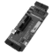
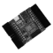
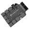

# Quickstart

Learn how to integrate FREE-WILi into your projects with step-by-step guides, examples, and best practices.

## Tools & Downloads 

Learn how to integrate FREE-WILi into your projects with step-by-step guides, examples, and best practices.

      

      <a href="https://freewili.com/freewili-gui/" target="_blank" class="card horizontal">
        

            <!-- Video Camera Icon -->
            <!-- <svg xmlns="http://www.w3.org/2000/svg" width="28" height="28" fill="none" stroke="currentColor" stroke-width="2" stroke-linecap="round" stroke-linejoin="round"><rect x="2" y="7" width="15" height="10" rx="2" ry="2"></rect><polygon points="17,11 22,8 22,16 17,13"></polygon></svg> -->
            <svg xmlns="http://www.w3.org/2000/svg" width="60" height="60" viewBox="0 0 24 24" fill="none" stroke="currentColor" stroke-width="0.4" stroke-linecap="round" stroke-linejoin="round" class="lucide lucide-layout-dashboard-icon lucide-layout-dashboard"><rect width="7" height="9" x="3" y="3" rx="1"/><rect width="7" height="5" x="14" y="3" rx="1"/><rect width="7" height="9" x="14" y="12" rx="1"/><rect width="7" height="5" x="3" y="16" rx="1"/></svg>
        

        

            <h3>FREE-WILi GUI </h3>
            
 Cross-platform interface for GPIO, SPI, I²C, UART, Radio, LEDs, audio, scripting, and file management.

        

      </a>
      

    

     <a href="https://github.com/freewili/freewili-updater" target="_blank" class="card horizontal">
        

            <!-- Microphone Icon -->
            <!-- <svg xmlns="http://www.w3.org/2000/svg" width="28" height="28" fill="none" stroke="currentColor" stroke-width="2" stroke-linecap="round" stroke-linejoin="round"><path d="M12 1a3 3 0 0 0-3 3v8a3 3 0 0 0 6 0V4a3 3 0 0 0-3-3z"></path><path d="M19 10v2a7 7 0 0 1-14 0v-2"></path><line x1="12" y1="19" x2="12" y2="23"></line><line x1="8" y1="23" x2="16" y2="23"></line></svg> -->
            <svg xmlns="http://www.w3.org/2000/svg" width="60" height="60" viewBox="0 0 24 24" fill="none" stroke="currentColor" stroke-width="0.4" stroke-linecap="round" stroke-linejoin="round" class="lucide lucide-circle-arrow-up-icon lucide-circle-arrow-up"><circle cx="12" cy="12" r="10"/><path d="m16 12-4-4-4 4"/><path d="M12 16V8"/></svg>
        

        

            <h3>FREE-WILi Updater</h3>
            
One-click tool to flash or update UF2 firmware. 

        

        </a>
    

## Scripting

   

      <a href="https://freewili.github.io/fwwasm/" target="_blank" class="card horizontal">
         

            <!-- Video Camera Icon -->
            <!-- <svg xmlns="http://www.w3.org/2000/svg" width="28" height="28" fill="none" stroke="currentColor" stroke-width="2" stroke-linecap="round" stroke-linejoin="round"><rect x="2" y="7" width="15" height="10" rx="2" ry="2"></rect><polygon points="17,11 22,8 22,16 17,13"></polygon></svg> -->
            <svg xmlns="http://www.w3.org/2000/svg" width="60" height="60" viewBox="0 0 24 24" fill="none" stroke="currentColor" stroke-width="0.4" stroke-linecap="round" stroke-linejoin="round" class="lucide lucide-braces-icon lucide-braces"><path d="M8 3H7a2 2 0 0 0-2 2v5a2 2 0 0 1-2 2 2 2 0 0 1 2 2v5c0 1.1.9 2 2 2h1"/><path d="M16 21h1a2 2 0 0 0 2-2v-5c0-1.1.9-2 2-2a2 2 0 0 1-2-2V5a2 2 0 0 0-2-2h-1"/></svg>
         

         

            <h3>WASM Examples</h3>
            
Ready-to-run sample projects showcasing capabilities.

         

      </a>
   

   

      <a href="https://freewili.github.io/freewili-python/index.html#installation" target="_blank" class="card horizontal">
         

            <!-- Microphone Icon -->
            <!-- <svg xmlns="http://www.w3.org/2000/svg" width="28" height="28" fill="none" stroke="currentColor" stroke-width="2" stroke-linecap="round" stroke-linejoin="round"><path d="M12 1a3 3 0 0 0-3 3v8a3 3 0 0 0 6 0V4a3 3 0 0 0-3-3z"></path><path d="M19 10v2a7 7 0 0 1-14 0v-2"></path><line x1="12" y1="19" x2="12" y2="23"></line><line x1="8" y1="23" x2="16" y2="23"></line></svg> -->
            <svg xmlns="http://www.w3.org/2000/svg" width="60" height="60" viewBox="0 0 24 24" fill="none" stroke="currentColor" stroke-width="0.4" stroke-linecap="round" stroke-linejoin="round" class="lucide lucide-file-code2-icon lucide-file-code-2"><path d="M4 22h14a2 2 0 0 0 2-2V7l-5-5H6a2 2 0 0 0-2 2v4"/><path d="M14 2v4a2 2 0 0 0 2 2h4"/><path d="m5 12-3 3 3 3"/><path d="m9 18 3-3-3-3"/></svg>
         

         

            <h3>Python Library and Examples</h3>
            
Python library for controlling and communicating with FreeWili.

         

      </a>
   

   

      <a href="https://github.com/freewili/freewili-updater" target="_blank" class="card horizontal">
         

            <!-- Microphone Icon -->
            <!-- <svg xmlns="http://www.w3.org/2000/svg" width="28" height="28" fill="none" stroke="currentColor" stroke-width="2" stroke-linecap="round" stroke-linejoin="round"><path d="M12 1a3 3 0 0 0-3 3v8a3 3 0 0 0 6 0V4a3 3 0 0 0-3-3z"></path><path d="M19 10v2a7 7 0 0 1-14 0v-2"></path><line x1="12" y1="19" x2="12" y2="23"></line><line x1="8" y1="23" x2="16" y2="23"></line></svg> -->
            <svg xmlns="http://www.w3.org/2000/svg" width="60" height="60" viewBox="0 0 24 24" fill="none" stroke="currentColor" stroke-width="0.4" stroke-linecap="round" stroke-linejoin="round" class="lucide lucide-hard-drive-download-icon lucide-hard-drive-download"><path d="M12 2v8"/><path d="m16 6-4 4-4-4"/><rect width="20" height="8" x="2" y="14" rx="2"/><path d="M6 18h.01"/><path d="M10 18h.01"/></svg>
         

         

            <h3>Firmware Files</h3>
            
Download stable, beta, and archived UF2 builds

         

      </a>
   

   

      <a href="https://freewili.com/png-to-fwi-converter/" target="_blank" class="card horizontal">
         

            <!-- Microphone Icon -->
            <!-- <svg xmlns="http://www.w3.org/2000/svg" width="28" height="28" fill="none" stroke="currentColor" stroke-width="2" stroke-linecap="round" stroke-linejoin="round"><path d="M12 1a3 3 0 0 0-3 3v8a3 3 0 0 0 6 0V4a3 3 0 0 0-3-3z"></path><path d="M19 10v2a7 7 0 0 1-14 0v-2"></path><line x1="12" y1="19" x2="12" y2="23"></line><line x1="8" y1="23" x2="16" y2="23"></line></svg> -->
            <svg xmlns="http://www.w3.org/2000/svg" width="60" height="60" viewBox="0 0 24 24" fill="none" stroke="currentColor" stroke-width="0.4" stroke-linecap="round" stroke-linejoin="round" class="lucide lucide-refresh-ccw-icon lucide-refresh-ccw"><path d="M21 12a9 9 0 0 0-9-9 9.75 9.75 0 0 0-6.74 2.74L3 8"/><path d="M3 3v5h5"/><path d="M3 12a9 9 0 0 0 9 9 9.75 9.75 0 0 0 6.74-2.74L21 16"/><path d="M16 16h5v5"/></svg>
         

         

            <h3>PNG → FWI Converter</h3>
            
Convert images for display on the badge

         

      </a>
   

      

      <a href="https://freewili.com/audio-to-wav-converter/" target="_blank" class="card horizontal">
         

            <!-- Microphone Icon -->
            <!-- <svg xmlns="http://www.w3.org/2000/svg" width="28" height="28" fill="none" stroke="currentColor" stroke-width="2" stroke-linecap="round" stroke-linejoin="round"><path d="M12 1a3 3 0 0 0-3 3v8a3 3 0 0 0 6 0V4a3 3 0 0 0-3-3z"></path><path d="M19 10v2a7 7 0 0 1-14 0v-2"></path><line x1="12" y1="19" x2="12" y2="23"></line><line x1="8" y1="23" x2="16" y2="23"></line></svg> -->
            <svg xmlns="http://www.w3.org/2000/svg" width="60" height="60" viewBox="0 0 24 24" fill="none" stroke="currentColor" stroke-width="0.4" stroke-linecap="round" stroke-linejoin="round" class="lucide lucide-audio-lines-icon lucide-audio-lines"><path d="M2 10v3"/><path d="M6 6v11"/><path d="M10 3v18"/><path d="M14 8v7"/><path d="M18 5v13"/><path d="M22 10v3"/></svg>
         

         

            <h3>Audio → WAV Converter</h3>
            
Prepare audio for playback on the badge.

         

      </a>
   

## Orca Series Modules

<!-- Learn how to use key features of Dyte, such as recording, breakout rooms, webinars, and more. -->

  <!-- 

        

        <svg></svg>
        

        

            <h3>Voice Conferencing</h3>
            
Integrate reliable voice calling experiences into your product.

        

    
 -->

   

      <a href="../extending-with-orcas/maestro-debug-orca/" target="_self" class="card horizontal">
         

            <!-- Video Camera Icon -->
            <!-- <svg xmlns="http://www.w3.org/2000/svg" width="28" height="28" fill="none" stroke="currentColor" stroke-width="2" stroke-linecap="round" stroke-linejoin="round"><rect x="2" y="7" width="15" height="10" rx="2" ry="2"></rect><polygon points="17,11 22,8 22,16 17,13"></polygon></svg> -->
            
         

         

            <h3>Maestro Debug Orca</h3>
            
Debug and develop with ease — RP2040 support with IO test points. - 

         

      </a>
   

   

      <a href="../extending-with-orcas/bottlenose-wifi-orca/" target="_self" class="card horizontal">
         

            <!-- Video Camera Icon -->
            <!-- <svg xmlns="http://www.w3.org/2000/svg" width="28" height="28" fill="none" stroke="currentColor" stroke-width="2" stroke-linecap="round" stroke-linejoin="round"><rect x="2" y="7" width="15" height="10" rx="2" ry="2"></rect><polygon points="17,11 22,8 22,16 17,13"></polygon></svg> -->
            
         

         

            <h3>Bottlenose WiFi & BT Orca </h3>
            
A compact ESP32-C6 board with Wi-Fi, BT, USB-C, and Qwiic — ideal for IoT prototyping.

         

      </a>
    

        

      <a href="../extending-with-orcas/jambu-orca/" target="_self" class="card horizontal">
         

            <!-- Video Camera Icon -->
            <!-- <svg xmlns="http://www.w3.org/2000/svg" width="28" height="28" fill="none" stroke="currentColor" stroke-width="2" stroke-linecap="round" stroke-linejoin="round"><rect x="2" y="7" width="15" height="10" rx="2" ry="2"></rect><polygon points="17,11 22,8 22,16 17,13"></polygon></svg> -->
            
         

         

            <h3>Jambu Serial LED Control Orca </h3>
            
8-channel LED driver breakout module for dynamic lighting control. 

         

      </a>
    

      

      <a href="https://whaletail.freewili.com/" target="_blank" class="card horizontal">
         

            <!-- Video Camera Icon -->
            <!-- <svg xmlns="http://www.w3.org/2000/svg" width="28" height="28" fill="none" stroke="currentColor" stroke-width="2" stroke-linecap="round" stroke-linejoin="round"><rect x="2" y="7" width="15" height="10" rx="2" ry="2"></rect><polygon points="17,11 22,8 22,16 17,13"></polygon></svg> -->
            
         

         

            <h3>WhaleTail Badge Orca </h3>
            
Compact badge module with CAN FD and 10BASE-T1L, built for industrial protocol learning.

         

      </a>
    

