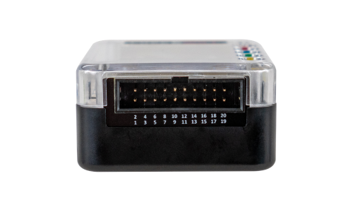

# GPIO
> Description of the GPIO header.

## Overview

Free Wil-i includes a GPIO pin header for interacting with digital protocols. This GPIO header is flexible, allowing varying voltage levels and IO direction. The pin-out and connector are shown below.

**NOTE PRODUCTION FREE WIL-I  (REV5) WILL MAKE GPIO 27 DEFAULT OUTPUT and GPIO26 DEFAULT INPUT. THIS DOCUMENT IS UPDATED FOR REV5 PRODUCTION HARDWARE.**

<figure>

<figcaption>Free Wil-i Pinout.</figcaption>
</figure>

 

<figure>

<figcaption>Free Wil-i GPIO Header</figcaption>
</figure>

## IO Voltage Levels

The IO voltage levels are shared by all the GPIO.  To set the voltage level you must inject a voltage on PIN4. This voltage can be set to 3.3v or 5.0v with a jumper. This would be a jumper between pins 2 and 4 for 5V. Or between 4 and 6 for 3.3V.

## GPIO Pin Descriptions

The table below describes the pins. All GPIO except dedicated I2C pins can be used bidirectionally depending on the application. So the directions are the default.

| Pin 	| Description         	| Default Direction 	| Notes                                                                        	|
|-----	|---------------------	|-------------------	|------------------------------------------------------------------------------	|
| 1   	| SPI Chip Select Out 	| Output            	|                                                                              	|
| 2   	| 5V Out              	| Output            	| 5V to power IO and external circuit                                          	|
| 3   	| GPIO27 OUT          	| Output            	| RPi 2040 GPIO27                                                              	|
| 4   	| V PINS IN           	| Input             	| Input to set the IO voltage 1.1 to 5.5V                                      	|
| 5   	| UART1 Rx IN         	| Input             	| RPi 2040 UART 1 Receive (GPIO9)                                              	|
| 6   	| 3.3V Out            	| Output            	| 3.3 V to Power IO and external circuit                                       	|
| 7   	| UART1 CTS IN        	| Input             	| RPi 2040 UART 1 Clear To Send (GPIO10)                                       	|
| 8   	| I2C0 SCL            	| In/Out            	| RPi 2040 I2C 0 Clock (GPIO17)                                                	|
| 9   	| UART1 TX OUT        	| Output            	| RPi 2040 UART1 Transmit (GPIO8)                                              	|
| 10  	| I2C0 SDA            	| In/Out            	| RPi I2C 0 Data (GPIO16)                                                      	|
| 11  	| UART1 RTS OUT       	| Output            	| RPi 2040 UART 1 Request To Send (GPIO11)                                     	|
| 12  	| SPI1 RX IN          	| Input             	| RPi 2040 SPI 1 Receive (GPIO12)                                              	|
| 13  	| SPI1 TX OUT         	| Output            	| RPi 2050 SPI 1 Transmit (GPIO15)                                             	|
| 14  	| GPIO 26 IN          	| Input             	| RPi 2040 GPIO26                                                              	|
| 15  	| SPI1 SCLK OUT       	| Output            	| RPi 2040 SPI 1 Clock (GPIO14)                                                	|
| 16  	| SWCLK IN            	| Input             	| RPi 2040 debugger clock input for external SWD debugger.                     	|
| 17  	| GPIO25 OUT          	| Output            	| RPi 2040 GPIO25. GPIO25 also connects to board status LED (same as RPi Pico) 	|
| 18  	| SWDIO               	| In/Out            	| RPi 2040 debugger IO for external SWD debugger.                              	|
| 19  	| GND                 	|                   	|                                                                              	|
| 20  	| GND                 	|                   	|                                                                              	|

## I2C Interface

The I2C interface is connected to the RPi I2C0 peripheral. The I2C Interface uses the chip PCA9517 for buffering. Please see the data sheet below for details.

<!-- <a target="\_blank" href={require('./assets/PCA9517-3139014.pdf').default}> Download this docx </a> -->

import Card from '@site/src/components/Card';

<Card 
  title="PCA9517-3139014.pdf"
  description="pdf"
  link="./img/PCA9517-3139014.pdf" 
  imageUrl="/img/png-download.png"
/>

## IO Pins Interface

All the GPIO that is not I2C uses the sn74lxc1t45 for buffering.

<Card 
  title="sn74lxc1t45.pdf"
  description="pdf"
  link="./img/sn74lxc1t45.pdf" 
  imageUrl="/img/png-download.png"
/>