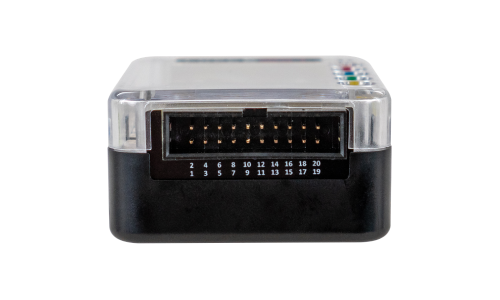

# GPIO

## Overview

FREE-WILi includes a GPIO pin header for interacting with digital protocols. This GPIO header is flexible, allowing varying voltage levels and IO direction control. The GPIO system supports SPI, I2C, UART, and general-purpose digital I/O operations.

<figure>

<figcaption>FREE-WILi Pinout.</figcaption>
</figure>

 

<figure>

<figcaption>FREE-WILi GPIO Header</figcaption>
</figure>

## GPIO System Architecture

The GPIO pins are routed through level-shifting buffers and an [iCE40UP5K FPGA](./../hardware-low-level-details/ice40-fpga/) before connecting to the RP2040 main processor. This architecture enables real-time operations such as the [logic analyzer](./../io-app/logic-analyzer/) functionality while maintaining protocol compatibility.

## Quick Start

1. **Set I/O Voltage Level**: Connect a jumper between pins 2-4 (5V) or 4-6 (3.3V)
    - Pin 4 **MUST** have voltage for GPIO to function
2. **Configure Pin Directions**: Use the GPIO panel in the GUI or [settings menu](./../io-app/settings-menu/) via serial console
3. **Select Protocol**: Access SPI, I2C, or UART functionality through the main console application

## GPIO Documentation Sections

- [**Pinout & Electrical Specifications**](./gpio-pinout) - Pin descriptions, voltage levels, and electrical characteristics
- [**Protocol Configuration**](./gpio-protocols.md) - SPI, I2C, and UART setup and specifications
- [**Common Issues & Troubleshooting**](./gpio-troubleshooting.md) - Solutions to frequent problems

## Related Documentation

- [Logic Analyzer](./../io-app/logic-analyzer/) - Real-time GPIO monitoring and analysis
- [WASM Scripting](./../io-app/scripting-with-wasm/) - Advanced GPIO control through WebAssembly
- [ZoomIO Scripting](./../io-app/scripting-with-zoomio/) - Nanosecond-precision GPIO timing
- [Settings Menu](./../io-app/settings-menu/) - GPIO direction and protocol configuration
