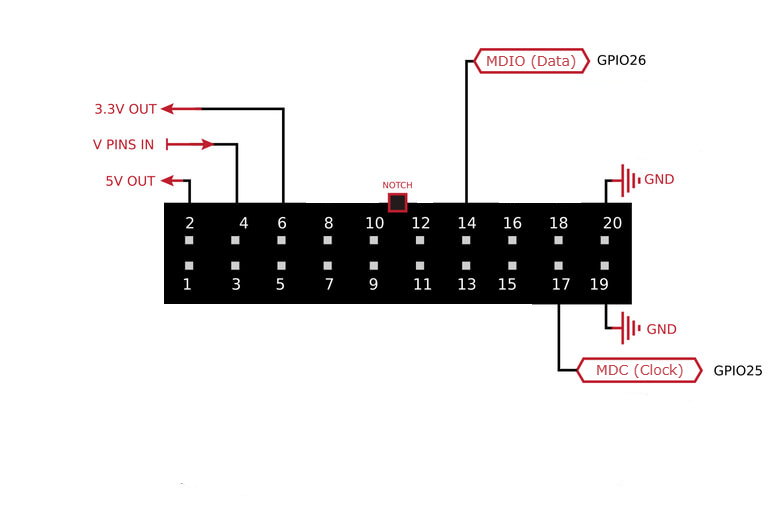
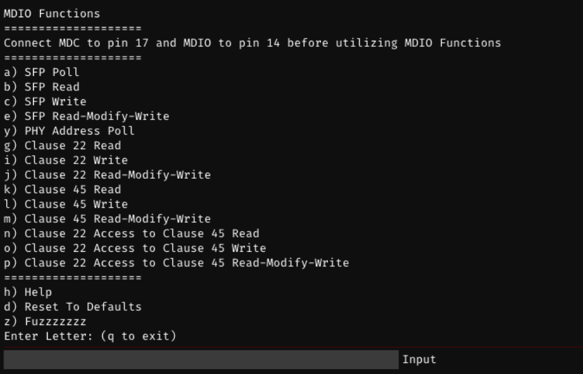

# MDIO

## Overview

MDIO (Management Data Input/Output) is a two-wire serial interface defined by IEEE 802.3 for reading and writing registers inside Ethernet PHY chips. It consists of two signals:

- **MDC** — the clock line, driven by FREE-WILi
- **MDIO** — the bidirectional data line

FREE-WILi's MDIO feature lets you directly control PHY registers over the MDIO bus without relying on a higher-level Ethernet framework. This is useful for debugging link negotiation, configuring PHY parameters, testing network hardware, and exploring automotive or industrial Ethernet PHY behavior.

FREE-WILi supports three MDIO access modes:

| Mode | Description |
|---|---|
| **Clause 22** | Original MDIO standard. Addresses up to 32 PHYs with 32 registers each. |
| **Clause 45** | Extended MDIO for 10G+ Ethernet. Adds a device (MMD) address tier and a 16-bit register space per device. |
| **Clause 22 Access to Clause 45** | An indirect method that uses Clause 22 framing to reach Clause 45 registers on PHYs that support it. Useful for older controllers. |

In addition, FREE-WILi can communicate with the **[Intrepid Control Systems 1000BASE-T1 SFP Module](https://intrepidcs.com/products/automotive-ethernet-tools/88q2112-1000base-t1-sfp/)** via an on-board I2C-to-MDIO bridge. See the [1G SFP Hardware Tour](https://guide.intrepidcs.com/docs/1000BASE-T1-SFP/A-Tour-of-1G-SFP-Hardware.html#) for further detail on the module.

## Hardware Setup

### Pin Assignment

Connect your target device to the FREE-WILi GPIO header before using any MDIO function.

| Signal | GPIO Header Pin | Direction |
|---|---|---|
| MDC (clock) | **Pin 17** | Output |
| MDIO (data) | **Pin 14** | Bidirectional |

:::tip
Make sure Pin 4 (V PINS IN) has a voltage applied that matches your target device (e.g., jumper to Pin 6 for 3.3V or Pin 2 for 5V). GPIO will not function without this. See [Pinout & Electrical Specifications](./gpio-pinout) for full details.
:::

<div class="text--center">

<figure>


<figcaption>MDIO wiring — MDC to Pin 17, MDIO to Pin 14.</figcaption>
</figure>
</div>

## Quick Start

1. **Wire your device**: Connect MDC to Pin 17 and MDIO to Pin 14 on the GPIO header.
2. **Apply I/O voltage**: Ensure Pin 4 (V PINS IN) has the correct voltage for your target (3.3V is most common).
3. **Open the MDIO menu**: In the FREE-WILi serial console, navigate to the MDIO Functions menu.
4. **Poll for PHYs**: Run **PHY Address Poll** (`y`) to discover which PHY addresses respond and which MDIO clauses they support.
5. **Read or write a register**: Use a Clause 22 or Clause 45 read/write command with the address information from the poll.

## Understanding MDIO Clauses

### Clause 22

The original MDIO specification. Each PHY on the bus has a 5-bit address (0–31), and each PHY exposes up to 32 registers (also 5-bit addressed). All register reads and writes are 16-bit values.

### Clause 45

An extension introduced for 10 Gigabit Ethernet. Clause 45 adds a third address tier called the **MMD** (MDIO Manageable Device) address, also 5-bit. Each MMD then exposes a full 16-bit register space (up to 65,536 registers). This is how modern high-speed PHYs expose their full configuration.

### Clause 22 Access to Clause 45 (Indirect Access)

Some PHYs support Clause 22 framing but implement an indirect addressing mechanism to access their Clause 45 registers. This works by first writing the target MMD device and register address into specific Clause 22 registers, then performing the read or write through a data register. FREE-WILi handles this automatically when you use the indirect access commands. This mode is useful when your controller or test setup only supports Clause 22 transactions but the PHY has Clause 45 registers you need to reach.

## MDIO Menu Commands

Navigate to **MDIO Functions** in the serial console (found in the Extended Functions Menu). The menu prompt will remind you to connect MDC to pin 17 and MDIO to pin 14.

<div class="text--center">

<figure>


<figcaption>MDIO Serial Console.</figcaption>
</figure>
</div>

### PHY Discovery

| Key | Command | Description |
|---|---|---|
| `y` | **PHY Address Poll** | Scans all 32 PHY addresses and reports which respond, along with their Clause 22, Clause 45, and emulation compatibility. |
| `a` | **SFP Poll** | Probes the [Intrepid CS 1000BASE-T1 SFP Module](https://intrepidcs.com/products/automotive-ethernet-tools/88q2112-1000base-t1-sfp/) via the I2C-to-MDIO bridge. If found, returns the PHY identifier, temperature (°C), and Signal Quality Indicator (SQI). |

### Clause 22 Operations

| Key | Command | Arguments | Description |
|---|---|---|---|
| `g` | **Clause 22 Read** | PHY Address, Register Address | Reads a 16-bit value from a register on a Clause 22 PHY. |
| `i` | **Clause 22 Write** | PHY Address, Register Address, Data (2 bytes) | Writes a 16-bit value to a register on a Clause 22 PHY. |
| `j` | **Clause 22 Read-Modify-Write** | PHY Address, Register Address, Mask (2 bytes), Data (2 bytes) | Reads the current register value, applies a mask, then writes only the masked bits. `1` bits in the mask are overwritten. |

### Clause 45 Operations

| Key | Command | Arguments | Description |
|---|---|---|---|
| `k` | **Clause 45 Read** | PHY Address, MMD Address, Register Address | Reads a 16-bit value from a register on a Clause 45 PHY. |
| `l` | **Clause 45 Write** | PHY Address, MMD Address, Register Address, Data (2 bytes) | Writes a 16-bit value to a register on a Clause 45 PHY. |
| `m` | **Clause 45 Read-Modify-Write** | PHY Address, MMD Address, Register Address, Mask (2 bytes), Data (2 bytes) | Reads the current register value, applies a mask, then writes only the masked bits. `1` bits in the mask are overwritten. |

### Clause 22 Access to Clause 45 (Indirect Access)

| Key | Command | Arguments | Description |
|---|---|---|---|
| `n` | **Clause 22 Access to Clause 45 Read** | PHY Address, MMD Address, Register Address | Reads a Clause 45 register via Clause 22 indirect addressing. |
| `o` | **Clause 22 Access to Clause 45 Write** | PHY Address, MMD Address, Register Address, Data (2 bytes) | Writes a Clause 45 register via Clause 22 indirect addressing. |
| `p` | **Clause 22 Access to Clause 45 Read-Modify-Write** | PHY Address, MMD Address, Register Address, Mask (2 bytes), Data (2 bytes) | Read-Modify-Writes a Clause 45 register via Clause 22 indirect addressing. |

### SFP Bridge Operations (Intrepid CS 1000BASE-T1)

These commands communicate with the Intrepid Control Systems 1000BASE-T1 SFP Module through the on-board I2C-to-MDIO bridge.

| Key | Command | Arguments | Description |
|---|---|---|---|
| `a` | **SFP Poll** | *(none)* | Probes the SFP module. If found, returns the PHY identifier, temperature (°C), and Signal Quality Indicator (SQI). |
| `b` | **SFP Read** | Device Address, Register Address (2 bytes) | Reads a 16-bit value from a register on the specified SFP device. |
| `c` | **SFP Write** | Device Address, Register Address (2 bytes), Data (2 bytes) | Writes a 16-bit value to a register on the specified SFP device. |
| `e` | **SFP Read-Modify-Write** | Device Address, Register Address (2 bytes), Mask (2 bytes), Data (2 bytes) | Read-Modify-Writes a register on the specified SFP device. `1` bits in the mask are overwritten. |

## Argument Format

All addresses and data are entered as hexadecimal values separated by spaces.

| Argument Type | Format | Example | Notes |
|---|---|---|---|
| PHY Address | `hex8` | `01` | 5-bit address, 0–31 |
| MMD Address | `hex8` | `01` | 5-bit device address, 0–31 |
| Register Address (Clause 22) | `hex8` | `02` | 5-bit, 0–31 |
| Register Address (Clause 45) | `hex16` | `0003` | 16-bit, 0–65535 |
| Data / Mask | `hexbytes` | `FF FF` | Two space-separated bytes forming a 16-bit value |

## Command Examples

### Discover PHYs on the Bus

```
y
```
Example output:
```
PHY found at address 04. Compatibility: Clause 22 Clause 45.
PHY found at address 07. Compatibility: Clause 22 Clause 22 Access to Clause 45.
```

### Read a Clause 22 Register

Read register `0x02` (PHY Identifier 1) from the PHY at address `0x04`:

```
g 04 02
```
Output:
```
Read 0022 from address 02 on PHY 04
```

### Write a Clause 22 Register

Write `0x1200` to register `0x00` (Control register) on PHY `0x04`:

```
i 04 00 12 00
```
Output:
```
Wrote 1200 to address 00 on PHY 04
```

### Read-Modify-Write a Clause 22 Register

On PHY `0x04`, register `0x00`, set only bit 9 (restart auto-negotiation) without touching other bits. Mask = `0x0200`, Data = `0x0200`:

```
j 04 00 02 00 02 00
```
Output:
```
Wrote 1A00 to address 00 on PHY 04
```

### Read a Clause 45 Register

Read register `0x0003` on MMD `0x01` (PMA/PMD PHY Identifier 2) from PHY `0x04`:

```
k 04 01 0003
```
Output:
```
Read 0141 from address 0003 on MMD 01 on PHY 04
```

### Poll the SFP Module

```
a
```
Output (module present):
```
SFP ID: 58. PHY Temp: 42 C, PHY SQI: 7
```
Output (module not found):
```
SFP Module not Found
```

## GUI Log Panel

The MDIO feature includes a GUI log panel that displays the results of read, write, and poll operations in real time. Successful results are shown in blue; failures or "not found" responses are shown in red.

## Troubleshooting

| Symptom | Likely Cause | Solution |
|---|---|---|
| PHY Address Poll returns "No MDIO PHYs Found" | MDC/MDIO not connected, or wrong voltage level | Check wiring to Pin 17 (MDC) and Pin 14 (MDIO). Verify Pin 4 has correct voltage. |
| "Failed to initialize MDIO" error | Internal initialization failure | Check that Pin 4 (V PINS IN) has voltage applied. |
| "Invalid Arguments: Parse Error" | Incorrect argument count or format | Verify all arguments are provided as space-separated hex values in the correct order. |
| SFP Poll returns "SFP Module not Found" | SFP module not connected or not powered | Confirm the Intrepid CS 1000BASE-T1 SFP module is seated and powered. |
| Read returns `0000` or `FFFF` for all registers | No device at that PHY address | Run PHY Address Poll (`y`) first to confirm the valid address. |

## Related Documentation

- [GPIO Pinout & Electrical Specifications](./gpio-pinout.md) — GPIO header pin map and voltage level configuration
- [GPIO Overview](./gpio.md) — Introduction to all GPIO protocols on FREE-WILi
