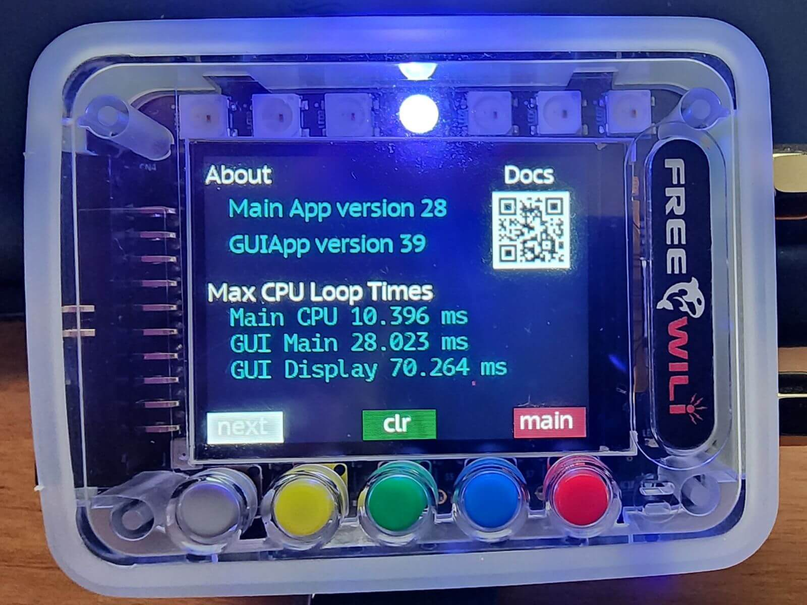

# About App

The FREE-WILi has an about app the contains screens about the device. The main about screen includes information about the version of firmware running on the main and display processors. It also includes loop times which are just an idea of how fast the FREE-WILi IO app and GUI app are running. The clr button will reset these maximum times.

The about app also include screens for [RTC](/io-app/settings-menu/rtc-settings/) and [Battery Charging](/gui-screen-buttons-and-lights/li-ion-battery-and-power-management/), these are described in the relative topics.

<figure>

<figcaption>The about screen includes version information, loop times and documentation links.</figcaption>
</figure>

