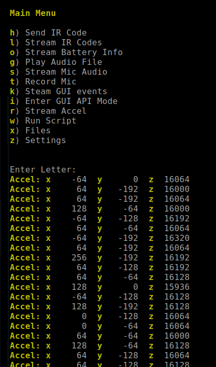

# Accelerometer

FREE-WiLi includes an accelerometer part number LIS3DH from ST microelectronics. The Accel sensor data is viewable from the serial menu and is usable from the API. The mounting is such that the Z direction points up from the screen and the X axis points towards the IO Connector.

<figure>

<figcaption>Stream Accel data from the display processor menu.</figcaption>
</figure>

import Card from '@site/src/components/Card'; 

<Card 
  title="LIS3DH - STMicroelectronics"
  description="STMicroelectronics"
  link="https://www.st.com/en/mems-and-sensors/lis3dh.html" 
  imageUrl="https://www.st.com/etc/clientlibs/st-site/media/app/images/favicon-32.png"
/>

 

<figure>

<figcaption>X Axis points to the IO Connector and Y points to the buttons, Z point out of the screen.</figcaption>
</figure>

