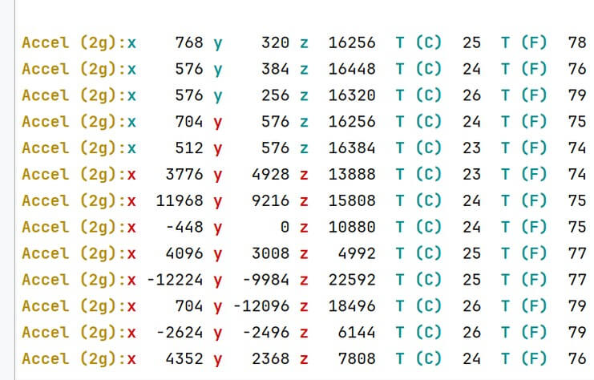
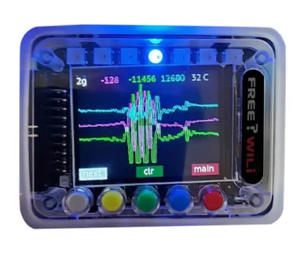
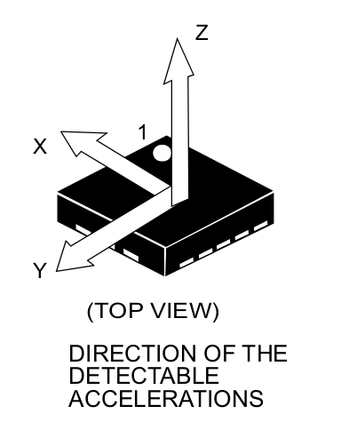

# Sensors: Accelerometer & Temperature

FREE-WILi includes an accelerometer part number LIS3DH from ST microelectronics. The Accel sensor data is viewable from the serial menu (below) and is usable from the API. The mounting is such that the Z direction points up from the screen and the X axis points towards the IO Connector.

<div class="text--center">

<figure>


<figcaption>Accel data is shown in the serial terminal.</figcaption>
</figure>
</div>

## Sensors App

The sensors app Accel and Temperature will display accelerometer in a graphical form on the FREE-WILi screen. The top line shows the the current range, x, y ,z and temperature. If the axis broke the move threshold it will be temporarily white text. Below is a plot of the sensor. The LED will indicate x, y, z in both led position and color. This is usable anytime as a light show.

<div class="text--center">

<figure>


<figcaption></figcaption>
</figure>
</div>

## Sensor Settings

The sensor settings contain the settings for the accelerometer. This includes a range and a move threshold. The ranges supported by the Accel include 2, 4, 8, and 16. The move threshold is how much a Accel axis must change indicate FREE-WILi is moving. The moving signal can awake the screen or create events for your custom wasm scripts.

The temperature calibration allow you to tweak the default scaling of the rp chips internal temperature sensor. The calibration applies a floating point scale and offset to the default temperature scaling.

<div class="text--center">

<figure>


<figcaption></figcaption>
</figure>
</div>

## API Support

The setSensorSettings API call will enabled the sensors to be reported at a specific rate through a GUI event. Also, it can also add the sensor value to an indicated plot data store. The event `FWGUI_EVENT_GUI_SENSOR_DATA` will report sensor data. The Accel and sensors can also be logged to a text log with the API `setAppLogSettings` below.

```C
// FWGUI_EVENT_GUI_SENSOR_DATA 

if (stEvents[iCount].iEvent == FWGUI_EVENT_GUI_SENSOR_DATA) {
                                short iX = stEvents[iCount].btData[0] | (stEvents[iCount].btData[1]<<8);
                                short iY = stEvents[iCount].btData[2] | (stEvents[iCount].btData[3]<<8);
                                short iZ = stEvents[iCount].btData[4] | (stEvents[iCount].btData[5]<<8);
                                short iTc = stEvents[iCount].btData[6] | (stEvents[iCount].btData[7]<<8);
                                short iTf = stEvents[iCount].btData[8] | (stEvents[iCount].btData[9]<<8);
                                int iMoving = stEvents[iCount].btData[10] & 0x1;
                                int iMovingX = stEvents[iCount].btData[10] & 0x2 ? 1 : 0;
                                int iMovingY = stEvents[iCount].btData[10] & 0x4 ? 1 : 0;
                                int iMovingZ = stEvents[iCount].btData[10] & 0x8 ? 1 : 0;
                                printf("x %d y %d z %d T %d C T %d F moving %d  moveX %d moveY %d moveZ %d",iX, iY,iZ, iTc, iTf,iMoving,iMovingX,iMovingY,iMovingZ);
                        }

```

```c

// API to enable accelerometer data

void setSensorSettings(int bStreamAccel, int iRateMilliseconds,
			int bEnableAccelXPlotData, int iAccelXPlotDataIndex,
			int bEnableAccelYPlotData, int iAccelYPlotDataIndex,
			int bEnableAccelZPlotData, int iAccelZPlotDataIndex,
			int bEnableTempPlotDataC, int iTempPlotDataIndexC,
			int bEnableTempPlotDataF, int iTempPlotDataIndexF
			);
			
void setAppLogSettings(int bLogIRCodes, int bLogAccel, 
			int bLogTempC, int bLogTempF, int iLogIndex);

```


## Sensor Details

import Card from '@site/src/components/Card'; 

<Card 
  title="LIS3DH - STMicroelectronics"
  description="STMicroelectronics"
  link="https://www.st.com/en/mems-and-sensors/lis3dh.html" 
  imageUrl="https://www.st.com/etc/clientlibs/st-site/media/app/images/favicon-32.png"
/>

<br/>

<div class="text--center">

<figure>


<figcaption>X Axis points to the IO Connector and Y points to the buttons, Z point out of the screen.</figcaption>
</figure>
</div>