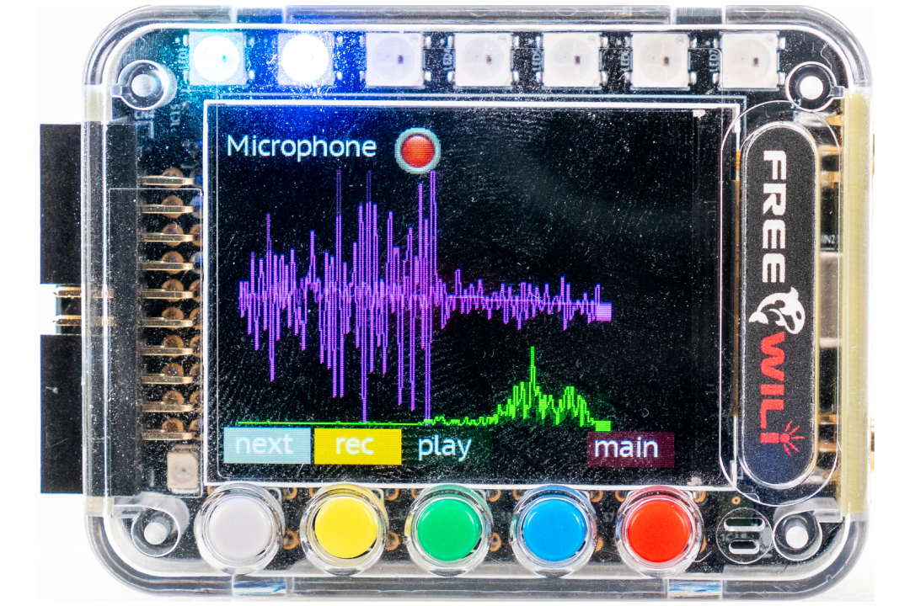
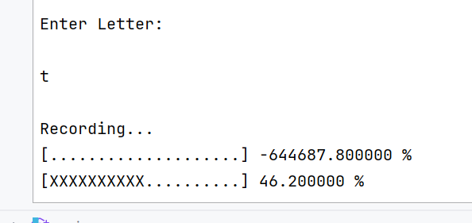
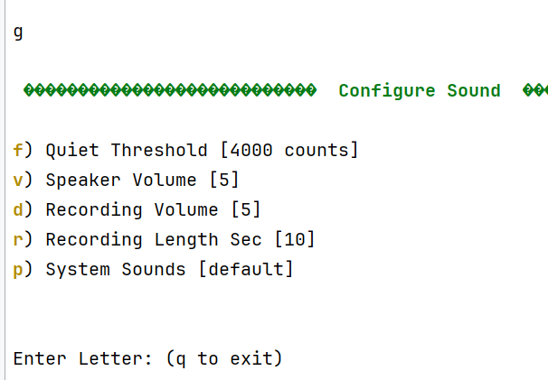

# Capturing Audio from Microphone

FREE-WILi has a integrated microphone. The microphone data is captured at a 8000 hz rate. This microphone data is fed to a FFT algorithm for display or provided via the GUIAPI. The sensors app shows the activity from the microphone from a sound level and frequency perspective.

<div class="text--center">

<figure>


<figcaption>Sensors App for the microphone.</figcaption>
</figure>
</div>

The serial menu provides a way to record the microphone to a wav file. A recording can also be triggered by the GUIAPI. These are recorded to the record directory.

<div class="text--center">

<figure>


<figcaption>Enter 't' from the display serial console will record a wav file.</figcaption>
</figure>
</div>

Also, the 's' menu in the display console will stream audio to host as text integers.

## Sensors App Microphone View

The sensors app has a microphone shown above. This view also you to record a wave file and play it back. The virtual LED shows if the sound quiet threshold was exceeded. Also, the LED light show indicates sound level.


## Settings

The recording time and volume level can be configured in the settings serial menu. This menu can also set a threshold to determine if the noise level is loud to indicate sound is present. This can be used to trigger device actions like waking up the screen. The record volume can also be set. 5 is the default volume.

<div class="text--center">

<figure>


<figcaption></figcaption>
</figure>
</div>

## API

You can record sounds using the API from wasm. The recordSound API allows you to record a sound to the file system for a specific length of time. 

The setAudioSettings will stream the microphone or fft result to the wasm script engine as events. You can also put the mic sound level and/or fft data into a plot data store.

```C
void recordSound(char * szSoundPath, int iLengthSeconds);

void setAudioSettings(bool bStreamMic, bool bStreamFFT, 
				bool bEnableMicPlotData, int iMICPlotDataIndex, 
				bool bEnableFFTPlotData, int iFFTPlotDataIndex);
```

## Technical Details

The format of the wave file is compatible with the [sound playback](/gui-screen-buttons-and-lights/making-sounds/) allowing you to play recorded sounds.