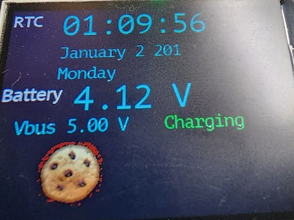

# Displaying Images

FREE-WILi allows you to display images on the screen. FREE-WILi has some built in images but a more interesting user interface can be done with custom images.

Custom images can be loaded into the FREE-WILi display processor file system. Then, using the API they can be displayed on command. The images should be stored in the "images" directory.

Custom images first must be converted to the FREE-WILi Image format. This is basically a bitmap that is compatible with the 565 color display used. The direct compatibility allows fast display of images without any runtime conversion.

A python script is written called `fw_image.py` that can convert a jpg or png to a FWI file. A FWI file is the image file you will download to FREE-WILi. This is available from the FREE-WILi github [https://github.com/freewili](https://github.com/freewili)

***Syntax of fw_image.py:***

`python3 fw_image.py source_image.png output_image.fwi`

## Displaying Images from the ROM

The FREE-WILi ROM contains a number of images you can use for your own applications. The following file lists the ROM images available.

import Card from '@site/src/components/Card';

<Card 
  title="FwRomAssets.pdf"
  description="pdf"
  link="/downloads/FwRomAssets.pdf" 
  imageUrl="/img/png-download.png"
/>

## Displaying Images from the API

The GUIAPI has a function for displaying images from files or ROM. Here we display `cookie.fwi` in the images directory.

`obGUIAPI.addControlPictureFromFile(iPanelNumber,PANEL_PICTURE_COOKIE,20,160,"cookie",1 );`

<div class="text--center">

<figure>


<figcaption>Cookie.fwi shown on FREE-WILi screen.</figcaption>
</figure>
</div>

To Display from ROM you can use this API

```c 
void addControlPicture(int iPanelIndex, int iControlIndex, int iX, int iY,
                   int iPictureId, int iVisible)
```

## Structure of Image File

The file consists of a binary header describing the file and the pixels. The pixels are stored in 16 bit 565 format. The 565 16 bit color format is a common format in embedded systems. There are a number of resources online that discuss this format. The best way to understand the format is to review the source code of `fw_image.py`

## Binary Header

The beginning of the file is below. Ints are 32 bit here and shorts are 16 bit.

```c
char szOut[8] = { "FW01IMG" };
unsigned int iImageFlags;
unsigned int iImageTotalPixelCount;
unsigned short iImageWidth;
unsigned short iImageHeight;
unsigned short iImageTransparentColor;
unsigned short iImageId;
```

## Pixel Data

The pixel data is described below. A 16 bit unsigned short contains the pixel with varying intensities for Red, Green, and Blue. The final value is byte swapped.

`rgb = (int(R)<<11) | (int(G)<<5) | int(B)` <br/>
`rgb = ((rgb << 8) & 0xFF00) | ((rgb >> 8) & 0xFF);`