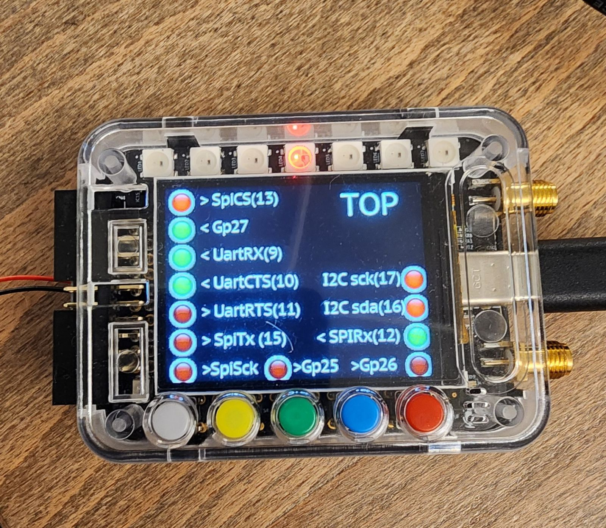

# GUI : Screen, Buttons, and Lights

The FREE-WILi has a user interface that makes interacting with the device use-able without a host PC. The user interface is controlled by a separate CPU and interfaces with the main CPU via a 8 Megabit hardware handshaking UART.

<figure>

<figcaption>Fw Display LEDs, and buttons</figcaption>
</figure>

The core parts of the user interface are listed below:

|                             	| **Description**                                	| **Notes** 	                                                                        |
|-----------------------------	|------------------------------------------------	|-------------------------------------------------------------------------              |
| Color Display               	| 320 x 240 16 bit color screen with GUI library 	| [more information](/gui-screen-buttons-and-lights/color-display-widgets/)             |
| Buttons                       | 5 Multi color buttons                             |           	                                                                        |
| Full Col  or LEDs             | 7 full color LEDs                                 |                  	                                                                    |
| Speaker                       | 16 bit audio                                      | [more information](/gui-screen-buttons-and-lights/making-sounds/)                     |
| Microphone                  	|                                                	| [more information](/gui-screen-buttons-and-lights/capturing-audio-from-microphone/)   |
| InfrRed Receiver           	| Reception of IR remote data                    	|           	                                                                        |
| Infrared Transmitter        	| Transmission of IR remote data                 	|           	                                                                        |
| Real Time Clock             	| Time and date powered from Lith ION battery    	|           	                                                                        |
| Lithium ION Battery Manager 	| Controls the Lith-ION battery                  	|           	                                                                        |
| Accelerometer                 | Used as sensor for custom applications            | [more information](/gui-screen-buttons-and-lights/accelerometer/)                     |