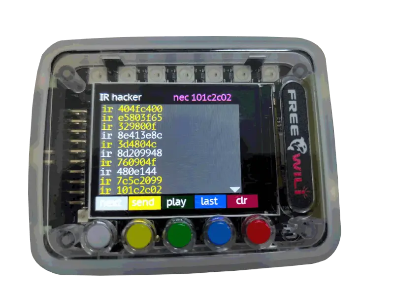

# IR Infrared Devices

FREE-WILi includes an Infrared receiver and transmitter. FREE-WILi allows you to send and receive control data in typical formats for remote control devices. Currently, while hardware supports many protocols, FREE-WILi software supports NEC protocol type devices (the most common type).

There is an IR App which offers two screens. One is an IR Hacker and the other is a custom remote control.

The IR Hacker app lets you view IR traffic received by the receiver. It also lets you send arbitrary codes, playback codes received, and fuzz IR codes to a specific device. 

The first code in a blast is highlighted yellow (this is often the most important one).  This will also be shown in the upper right corner. 

Clicking send will allows you to send an arbitrary IR code.

To use the fuzz function hold down the last button for 5 seconds and FREE-WILi will cycle through the 255 commands for last IR Address received (see this doc for explanation of NEC IR [https://techdocs.altium.com/display/FPGA/NEC+Infrared+Transmission+Protocol](https://techdocs.altium.com/display/FPGA/NEC+Infrared+Transmission+Protocol))

<div class="text--center">

<figure>


<figcaption>The IR Hacker App allows you to sniff and send IR data</figcaption>
</figure>
</div>

The IR Remote app allows you to create a custom remote by learning a specific remote. These remotes are saved in files in the file system. The first screen shows available remotes. You can select an existing remote or select new. Selecting new will create a new IR file. There is an integrated Roku remote which would let you control other FREE-WILi's.

After selecting a remote, you can add new codes. Simple point the remote at the FREE-WILi and press button on remote. FREE-WILi's led will flash. Then click new and give the command a name.

<div class="text--center">

<figure>


<figcaption>You can create a custom remote for IR devices.</figcaption>
</figure>
</div>

## Roku Remote Control of FREE-WILi

You can enable the Roku remote to control FREE-WILi. This works by receiving the codes and simluating the actual button presses.

| **Roku Button** 	| **Free Wili Action**   	| **Notes** 	|
|-----------------	|------------------------	|-----------	|
| up              	| Gray Button press      	|           	|
| down            	| Yellow Button Press    	|           	|
| ok/select       	| Green Button Press     	|           	|
| left            	| Blue Button Press      	|           	|
| right           	| Red Button Press       	|           	|
| home            	| Returns to main screen 	|           	|

## Settings

There is one setting for IR. This is to use the Roku Remote as a remote control.  This can be enabled or disabled.

## API

There is an API for sending IR codes in NEC format. Also any IR Recived will be sent as an Event.

```c

// Send IR Data
void sendIRData(unsigned int iData);

// IR Event Decoding
if (stEvents[iCount].iEvent == FWGUI_EVENT_IR_CODE)
                        {
                                unsigned int iIRCode;
                                iIRCode = stEvents[iCount].btData[0];
                                iIRCode |= ((unsigned int)stEvents[iCount].btData[1]) << 8;
                                iIRCode |= ((unsigned int)stEvents[iCount].btData[2]) << 16;
                                iIRCode |= ((unsigned int)stEvents[iCount].btData[3]) << 24;
                                printf("%x ",iIRCode);
                        }
```