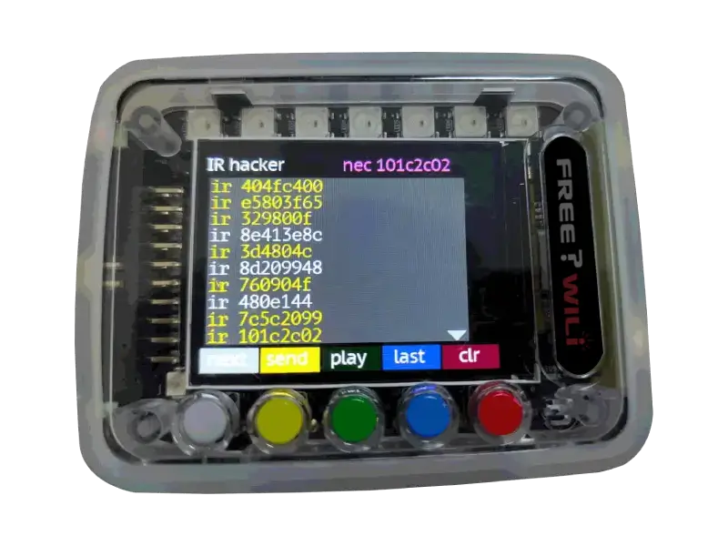

# IR (Infrared) Devices

FREE-WILi includes an infrared receiver and transmitter. FREE-WILi has the ability to send and receive IR data using the NEC protocol (the most common IR protocol). Currently, the NEC protocol is the only supported IR protocol.


Details about the NEC IR protocol can be found in this [document](https://sibotic.wordpress.com/wp-content/uploads/2013/12/adoh-necinfraredtransmissionprotocol-281113-1713-47344.pdf).

## IR App


There is an IR app (called “IR” in the main menu) which contains two screens. The first screen is the IR Hacker, and The second IR screen is for the Roku remote and custom remote controllers.


### IR Hacker


The IR Hacker allows a user to send and receive NEC IR messages. Messages sent or received in rapid succession have their first code shown in yellow, while subsequent codes are shown in white. The first code is also shown in the upper-right corner of the screen. 
<div class="text--center">


<figure>



<figcaption>The IR Hacker app can sniff and send NEC IR data</figcaption>
</figure>
</div>
The bottom of the screen shows the functions of each of the five buttons. The “next” button opens the remote control screen. The “send” button allows a user to enter an arbitrary 4-byte code to send via a NEC IR message frame. The “play” button replays a log of all IR messages received, and then clears that log. The “last” button plays the IR code shown in the upper-right corner of the screen. The “clr” button clears the log of IR messages.

</br>
Holding down the “last” button for 5 seconds activates the fuzz function. The fuzz function sends all 255 possible commands for the last IR Address received.


### IR Remote

The IR Remote screen can be used to create and utilize custom remotes. Each remote is a database of IR commands, and is stored in the file system of the FREE-WILi.
<div class="text--center">


<figure>


<figcaption>Create custom remotes for IR devices with FREE-WILi</figcaption>
</figure>
</div>
The IR Remote screen shows a list of available remotes. You can navigate the list of remotes with the “up” and “down” buttons, and the “select” button is used to select a remote. The “new” button creates a new custom remote, and the “main” button returns to the main menu. There is already an integrated Roku remote on the FREE-WILi. A Roku remote can also be used to control a FREE-WILi.


After selecting a remote, you can add new codes. Codes can be added by sending the code with the remote the user wishes to emulate.


## Roku Remote Control of FREE-WILi


You can enable the Roku remote to control FREE-WILi. This feature can be enabled or disabled in the settings menu of the display processor. This works by receiving IR codes from a Roku remote (or another FREE-WILi) and simulating the actual button presses on the FREE-WILi.


| **Roku Button**       | **FREE-WILi Action**          | **Notes**     |
|-----------------      |------------------------       |-----------    |
| up                    | Gray Button press             |               |
| down                  | Yellow Button Press           |               |
| ok/select             | Green Button Press            |               |
| left                  | Blue Button Press             |               |
| right                 | Red Button Press              |               |
| home                  | Returns to main screen        |               |


## API


There is an API for sending IR codes in NEC format. In addition, any IR command received appears as an event, so long as IR streaming is enabled in the IR Functions menu of the display processor.


```c
// Send IR Data
void sendIRData(unsigned int iData);


// IR Event Decoding
if (stEvents[iCount].iEvent == FWGUI_EVENT_IR_CODE)
                        {
                                unsigned int iIRCode;
                                iIRCode = stEvents[iCount].btData[0];
                                iIRCode |= ((unsigned int)stEvents[iCount].btData[1]) << 8;
                                iIRCode |= ((unsigned int)stEvents[iCount].btData[2]) << 16;
                                iIRCode |= ((unsigned int)stEvents[iCount].btData[3]) << 24;
                                printf("%x ",iIRCode);
                        }
```
## Sample Project: LG Remote


Many household TV remotes use the NEC IR protocol. In this example, a LG remote’s IR signals are sniffed by the FREE-WILi so that an IR database can be created.
<div class="text--center">


<figure>


<figcaption>Sample Project: LG Remote</figcaption>
</figure>
</div>


Once the IR codes from the remote are known, a WebAssembly (WASM) project can be developed. Using the new custom remote, another FREE-WILi can have IR streaming enabled, and have a WASM script monitor the IR codes received. Once received, the FREE-WILi can carry out arbitrary tasks. See the [Scripting with WASM](https://docs.freewili.com/io-app/scripting-with-wasm) page for information about how to use WASM with FREE-WILi. If you only have access to one FREE-WILi, you can just use the LG remote to control the FREE-WILi with IR streaming enabled and a WASM script.
```