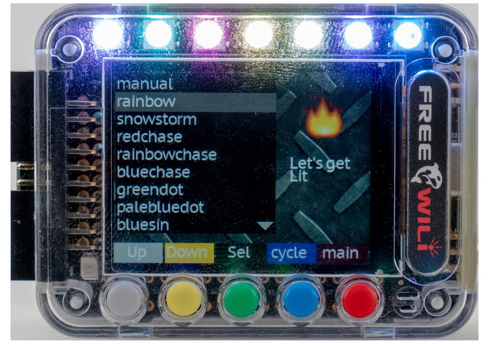
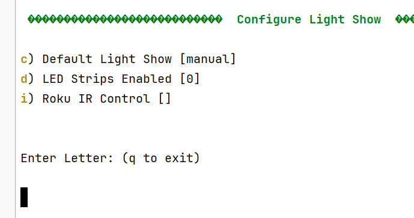

# LED Light Show

FREE-WILi has 7 full color LEDs. These LEDs can display a pattern or be manually controlled by the API or App. Some of the patterns incorporate sensor data or make the LEDs a bargraph. The LED pattern can also be sent out GPIO pins to support LED Light strips. The light show can be controlled by a Roku IR remote.

<div class="text--center">

<figure>


<figcaption>The FREE-WILi Light Show App controls the 7 LEDs.</figcaption>
</figure>
</div>

The Light show app has different patterns.  Two patterns use sensors. One is Audio and the other is accelerometer.

## Settings

The setting are show below. At startup you can pick a default light show. Also you can enable light strip control. Then you can enable a Roku IR remote to switch between the light show options.

<div class="text--center">

<figure>


<figcaption>Settings for the Light Show</figcaption>
</figure>
</div>

## API

There are APIs to control the board LEDS below. When setBoardLED is called it will disable the light show. 

You can set the LED to a static color or make it flash or fade. The setBoardLED allows you to use the LEDs this way.

```c

// Control Manual
enum fwLEDManagerLEDMode {
	ledsimplevalue,
	ledflash,
	ledpulse,
	ledflashfade,
	ledpulsefade,
};
void setBoardLED(int iLEDIndex0_7, 
        int iR, int iG, int iB, int iDurationMs, fwLEDManagerLEDMode iMode);

// Set a Light show        
void setLEDShowMode(int iLEDShow);

```