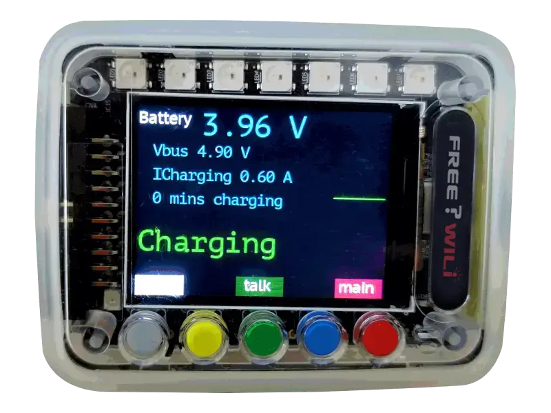

# Li-ION Battery and Power Management

FREE-WILi contains a Lithium ION Battery to support portable applications. This battery has the below specifications. Care should be taken leaving FREE-WILi in places where it could overheat (such as direct sunlight).

The main screen will indicate the battery status. By default the battery will be charged when plugged into USB.

How long the battery will last will depend on the current of the FREE-WILi. Substantial current savings can be found by using the screen timeout and limiting the use of the LEDs. Currently, the battery will last between 4 and 8 hours. In the future we expect this to improve with better sleep firmware.

## Lithium ION Battery specifications

|        **Spec**        	|       **Value**      	| **Notes** 	|
|:----------------------:	|:--------------------:	|:---------:	|
|         Energy         	|       1000 mAh       	|           	|
|     Charge Voltage     	|         4.2V         	|           	|
|       Charge Temp      	|   between 0 and 45C  	|           	|
|     Discharge Temp     	|  between -22 to 55 C 	|           	|
|      Storage Temp      	| between -10 C to 45C 	|           	|
|   Charger Current Max  	|       1000 maH       	|           	|
| Max discharge current  	|        1000 mA       	|           	|

## App

The About app contains a screen to monitor the Lithium battery charger. The battery voltage, supply voltage for charging, the charging current and the status are shown.

<figure>

<figcaption>About App indicating battery charging.</figcaption>
</figure>

<figure>

<figcaption>The about screen showing battery discharging</figcaption>
</figure>

## Settings

There are settings that control the power usage of FREE-WILi. This includes display brightness, display timeout, wake up sound, and wake up on move. Normally only the button presses wake the screen.

The wake up on sound will wake the display on a sound threshold while the move wakes if the device moves.

<figure>

<figcaption>You can save power by sleeping the display when battery powered.</figcaption>
</figure>

