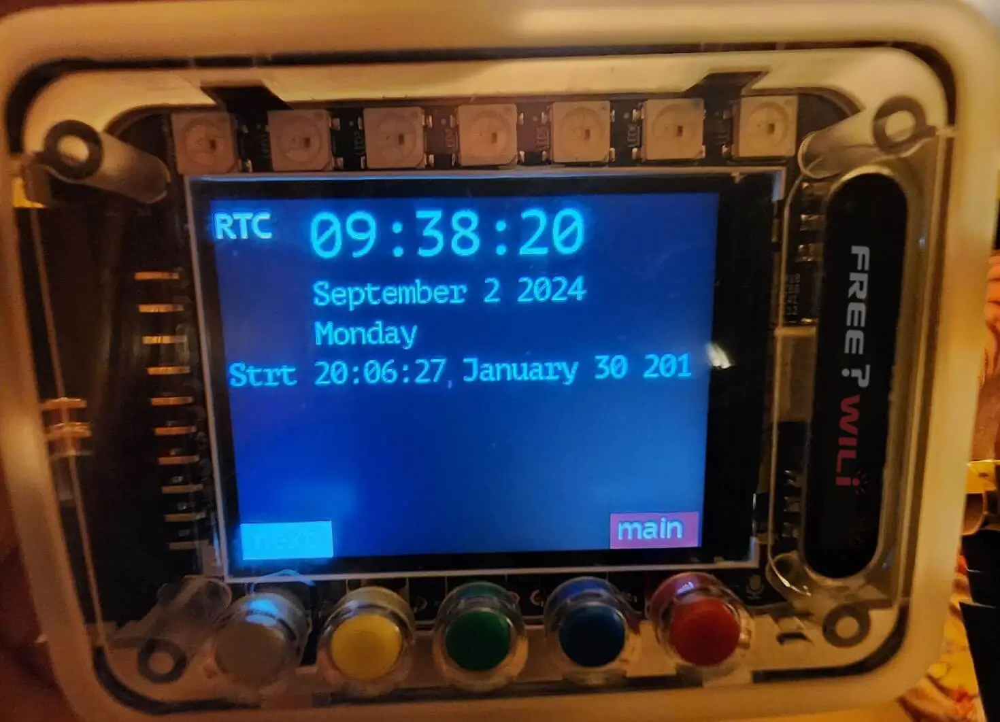
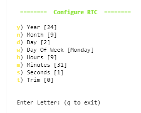

# RTC Real Time Clock

FREE-WILi includes a real time clock powered by the MCP7940N IC. The real time clock is used by the file system to timestamp files. The RTC also can be accessed by wasm for custom scripts such as logging files or doing tasks on alarms.

The RTC time is shown on the main screen. Also from the about app there is a RTC view.

## App

The about app will display the current RTC. The current time is shown as well as the time FREE-WILi started.

<div class="text--center">

<figure>


<figcaption>About App Screen</figcaption>
</figure>
</div>

## Settings

The RTC is currently set from the main USB serial interface (this will be supported in both CPUs in the future). 

The settings include a trim setting. This setting is loaded into the MCP7940N Trim (OSCTRIM) register. Please see the data sheet below for an explanation of this value. 

<div class="text--center">

<figure>


<figcaption>The settings allow you to set the RTC values.</figcaption>
</figure>
</div>

## API

The API supports querying and setting the RTC. The setRTC allows you to set the current time. The getRTC causes the RTC to be read and provided via an event.

```c
// set the RTC IC (Monday is 1 and 7 is Sunday (0 is invalid))
void setRTC(int iRTCHour, int iRTCMin, int iRTCSec, int iRTCWkDay, int iDay, int iRTCMth, int iRTCYear, int iTrim);
// request the current RTC via an event
void getRTC();


// RTC Event Response
if (stEvents[iCount].iEvent == FWGUI_EVENT_GUI_RTC_RESPONSE)
{
//iRTCHour, int iRTCMin, int iRTCSec, int iRTCWkDay,int iRTCDay, int iRTCMth,int iRTCYear
printf("%d:%d:%d day %d of month %d of year %d weekday %d trim %d", stEvents[iCount].btData[0],
                            stEvents[iCount].btData[1],
                            stEvents[iCount].btData[2],
                            stEvents[iCount].btData[4],
                            stEvents[iCount].btData[5],
                            stEvents[iCount].btData[6],
                            stEvents[iCount].btData[3],
                            stEvents[iCount].btData[7]
                            );
}
```

## Hardware Details

The MCP7940N  IC is used to implement the RTC. The data sheet is below. The RTC is always powered  from the Lithium ION battery. When FREE-WILi shuts down the battery will continue to supply power (about 1 micro amp) to the RTC until the battery is physically exhausted. At that point the RTC value will be lost.

import Card from '@site/src/components/Card'; 

<Card 
  title="MCP7940N"
  description=""
  link="https://www.microchip.com/en-us/product/mcp7940n" 
  imageUrl="/img/microchip.png"
/>