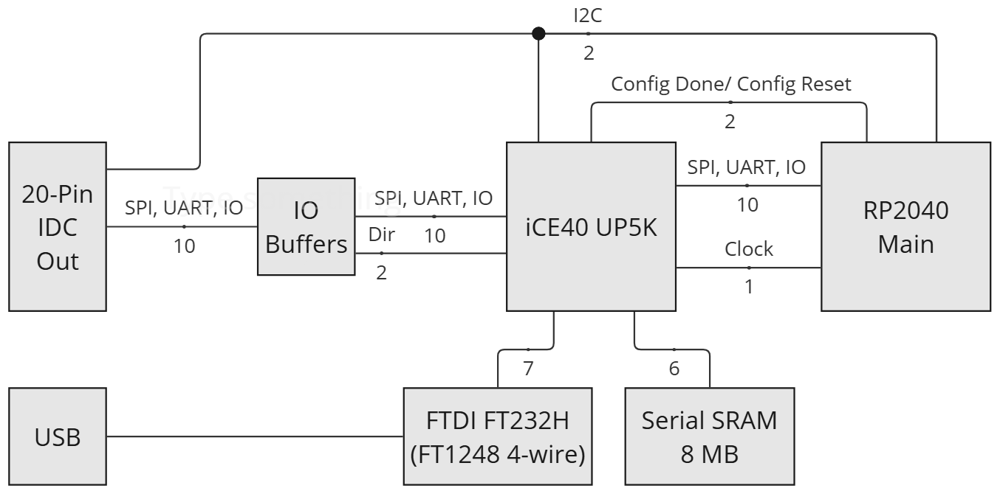

# iCE40 FPGA

The FREE-WILi contains an iCE40 FPGA between the RP2040 main processor and the IO drivers. The FPGA allows sophisticated high speed IO and state machines that can process IO and communicate to the RP2040 or communicate to the host directly using high speed USB.

The FPGA contains a [default application](/hardware-low-level-details/ice40-fpga/fpga-default-application/) so changing FPGA configuration is entirely optional. But changing the configuration is allowed and can be done at anytime and an unlimited number of times. See [FPGA Programming](/hardware-low-level-details/ice40-fpga/fpga-programming/) for details.

The FPGA is connected to a high speed FTDI USB interface and an 8Mbyte Serial SRAM. The block diagram is shown below.

<figure>

<figcaption></figcaption>
</figure>

The part numbers associated with the FPGA IO system are below:

| Part                	| Part Number      	| Notes                                                                                                                                     	|
|---------------------	|------------------	|-------------------------------------------------------------------------------------------------------------------------------------------	|
| FTDI USB            	| FT232HQ          	| Operates in FT1248 mode. [https://ftdichip.com/products/ft232hq/](https://ftdichip.com/products/ft232hq/)                                 	|
| Serial SRAM 8 MByte 	| APS6404L-3SQR-ZR 	| [https://www.apmemory.com](https://www.apmemory.com)                                                                                       	|
| FPGA                	| ICE40UP5K-SG48I  	| [https://www.latticesemi.com/en/Products/FPGAandCPLD/iCE40UltraPlus](https://www.latticesemi.com/en/Products/FPGAandCPLD/iCE40UltraPlus)  	|