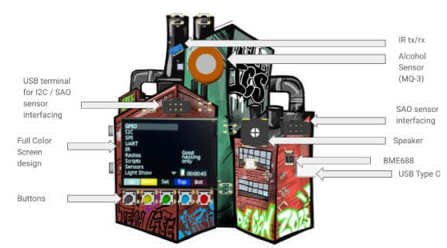
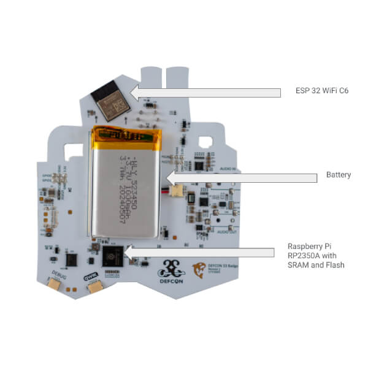
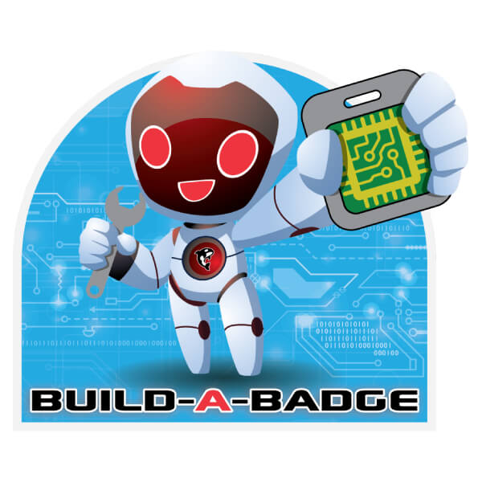

import YouTubeEmbed from '@site/src/components/YouTubeEmbed';

# 🤖 ICS Village Badge for DEFCON 33 with AI Power

:::warning[Disclaimers]

Every attempt is made to keep this documentation accurate and current. FREE-WILi reserves the right to update this documentation without notice and assumes no liability from its use.

:::

## Introduction and Overview

Thank you for purchasing a FREE-WILi [ICS Village](https://icsvillage.com/) Badge tool sponsored by FREE-WiLi and [Intrepid Control Systems](https://intrepidcs.com/). Thanks to our sponsors for allowing us to keep the prices low for everyone to get access to this badge at an affordable price.

The ICS Village Badge for DEF CON 33 is a hands-on tool designed to explore Industrial Control Systems (ICS) security. It expands on last year's FREE-WILi [Whale Tail badge](https://freewili.com/products/whale-tail/) by focusing on physical and environmental exploitation. With a rich set of built-in hardware, sensors, and software features, the badge allows you to interact with real-world ICS challenges.

The hardware is housed in a stunning, full-color PCB designed by Detroit artist [Kyle Irving](https://www.kyleriseirving.com/). At its core, the badge is powered by a **Raspberry Pi RP2350A microcontroller**.

**Front Side**

<figure>

<figcaption>Front Side View of the Badge.</figcaption>
</figure>

**Back Side**

<figure>

<figcaption>Back Side View of the Badge.</figcaption>
</figure>

#### Summary Key Features:

* BME688 – First gas sensor with AI and integrated high-linearity and high-accuracy pressure, humidity and temperature sensors   
* Alcohol Sensor (MQ-3)  
* ESP 32 WiFi C6  
* [XYZ Position sensor](../gui-screen-buttons-and-lights/accelerometer/)   
* [Infrared Receive and Transmit](../gui-screen-buttons-and-lights/ir-infrared-devices/)  
* Powered by Raspberry Pi RP2350A with SRAM and Flash  
* [Speaker](../gui-screen-buttons-and-lights/making-sounds/)  
* [320×240 Full Color Screen design](../gui-screen-buttons-and-lights/displaying-images/)  
* [5x Buttons](../gui-screen-buttons-and-lights/buttons/)   
* [5x Full color LEDs](../gui-screen-buttons-and-lights/led-light-show/)  
* [Real Time Clock (RTC)](../gui-screen-buttons-and-lights/rtc-real-time-clock/)  
* Compatible with FREE-WILI I2C applications  
* FREE-WILi GUI Application support  
* Full Color PCB by local Detroit artist [Kyle Irving](https://www.kyleriseirving.com/)  
* USB terminal for I2C / SAO sensor interfacing  
* I2C Expansion configured as DEFCON SAO  
* [1000 ma Lithium ION battery with integrated charger](../gui-screen-buttons-and-lights/li-ion-battery-and-power-management/)

#### Software Features

* Works with FREE-WILi GUI  
* WiFi interface for ESP32 with Websocket interface to FREE-WILi GUI  
* Fuzzer  
* USB Serial console API to control from host PC without installing any software  
* [WASM (webassembly) scripting](../io-app/scripting-with-wasm/) engine with examples for C/C++, Rust, Zig and Tiny Go  
* [Host API Python](https://github.com/freewili/freewili-python/) software  
* FAT File system  
* WASM API to control all device features  
* [GUI Software](../gui-screen-buttons-and-lights/) with custom panels and graphical controls  
* Integrated [sounds](../gui-screen-buttons-and-lights/making-sounds/) and [images](../gui-screen-buttons-and-lights/displaying-images/) in ROM for enhancing user apps  
* [Numbers To Speech](../gui-screen-buttons-and-lights/making-sounds/) feature to speak numbers  
* File formats compatible with existing market devices  
* Standard [USB boot-loader](../freewili-firmware-update/) for firmware updates  
* Raspberry Pi Pico (RP2350) Open Micro Platform for specific applications or custom code with C/C++, Micro-python or Circuit Python  
* Open source [github](https://github.com/freewili/) software for updates

:::info[]
<h4>🚀 We have released a new firmware updates for both the main and display components,   <a target="_blank" rel="noopener noreferrer" href="https://github.com/freewili/freewili-firmware" class="highlight">Check it out on GitHub</a> and get the latest version now.</h4>
<h4>📱 You can determine what firmware you have from the <a target="_self" rel="noopener noreferrer" href="../gui-screen-buttons-and-lights/about-app/" class="highlight-app">About app</a>. </h4>
:::

 

ICS village Badge has two RP2350 processors. Please follow the instructions in the **[FREE-WILi firmware](../freewili-firmware-update/)** update to update the badge manually. 

## 🎥 ⇨ Sensor View on the ICS Village DEFCON33 Badge: A Step-by-Step Guide

<YouTubeEmbed videoId="SxH4wWSY1L0" />

   

---

## 🎥 ⇨ Flash ESP32 on the ICS Village DEFCON33 Badge

<YouTubeEmbed videoId="hH2B_Icv48Y" />

   

---

## 🎥 ⇨ Exploring ESP32-C6 WiFi Features on the DEFCON 33 ICS Village Badge

<YouTubeEmbed videoId="wAfkV-FpKPw" />

   

---

## 🎥 ⇨ Exploring ESP32-C6 BT Features on the DEFCON 33 ICS Village Badge

Download the [Bluefruit Connect](https://play.google.com/store/apps/details?id=com.adafruit.bluefruit.le.connect&hl=en&gl=US&pli=1) app from the Google Play Store.

<YouTubeEmbed videoId="JAblyfNM6ss" />

   

## Build-A-Badge 🚀

<figure>

<figcaption></figcaption>
</figure>

An interactive badge customization application built with Rust and Iced GUI framework. Create and configure custom badges with personalized images, LED patterns, and names for DEFCON and other events.

### **Features**

* 🎨 Custom Image Selection \- Choose from 5 pre-loaded images or upload your own  
* 💡 LED Pattern Configuration \- 14 different LED light modes including Rainbow, Audio-reactive, and Accelerometer-based patterns  
* 📝 Badge Naming \- Personalize your badge with a custom name (up to 23 characters)  
* 🔧 Real-time Device Configuration \- Live console output during device programming  
* 📱 Cross-platform Support \- Available for Windows, macOS, and Linux  
* 🚀 WASM Application Support \- Upload and execute WebAssembly applications on your badge

### **Screenshots**

The application features a intuitive multi-step workflow:

1. Welcome Screen \- Introduction and getting started  
2. Image Selection \- Choose your badge image from available options  
3. LED Configuration \- Select LED light patterns and effects  
4. Badge Naming \- Enter your personalized badge name  
5. Configuration Summary \- Review and deploy to device

Install at [https://github.com/freewili/build\_a\_badge](https://github.com/freewili/build_a_badge) 