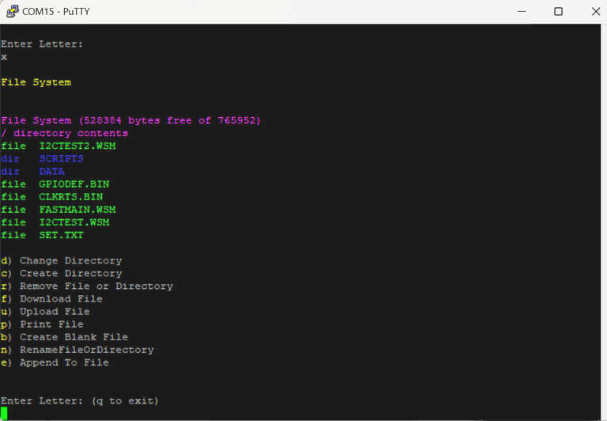

# File System Menu

The File System Menu allows you to interact with the file menu (shown below).

| **Command**              	| **Description**                                	| **Notes** 	|
|--------------------------	|------------------------------------------------	|-----------	|
| Change Directory         	| Changes the current directory                  	|           	|
| Create Directory         	| Creates a directory in the current directory   	|           	|
| Remove File or Directory 	|                                                	|           	|
| Download File            	| Send a file from the host to FREE-WILi device 	|           	|
| Upload File              	| Copy a file from FREE-WILi to host device     	|           	|
| Print File               	| Display file to the serial terminal            	|           	|
| Create Blank File        	| Creates an empty file                          	|           	|
| Rename File or Directory 	|                                                	|           	|
| Append to File           	|                                                	|           	|

<figure>

<figcaption></figcaption>
</figure>

