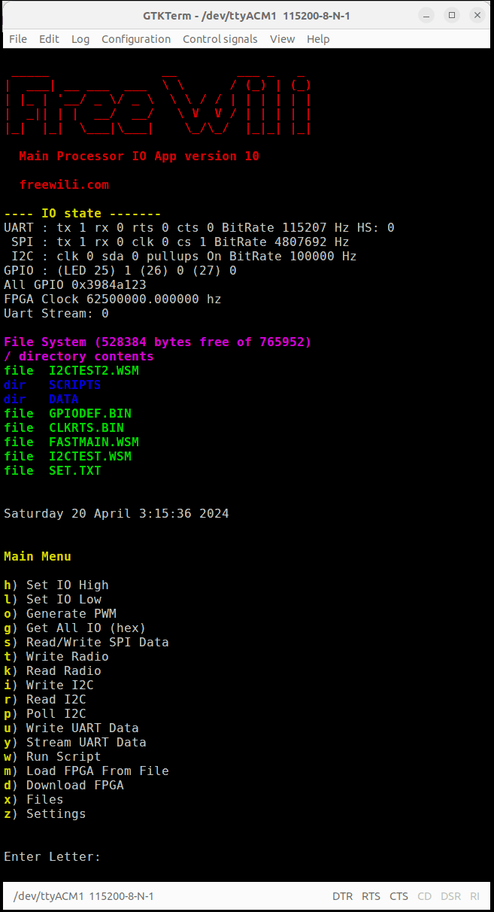
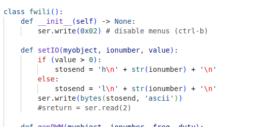

# IO App

FREE-WILi includes an IO app that allows you to read and write all the IO of FREE-WILi. This app has a Serial Command Line Interface, support for a host API,  on-board scripting, and a file system for stand-alone operations without a host.

The serial command line interface provides a menu tree of commands to control FREE-WILi's IO interfaces. This is shown below:

<figure>

<figcaption>FREE-WILi's Serial Command Line Interface Main Menu</figcaption>
</figure>

To use a command, press a letter and the enter key. Then follow the instructions.

The serial API is simply sending these menu commands and the data they expect. Below is a simple Python API that sets a GPIO high or low using the "h" and "l" commands. In API mode you can disable the menu text with by sending CTRL-B or reenable the menu text with CTRL-C.

<figure>

<figcaption></figcaption>
</figure>

On board scripting uses web assembly technology.  The code uses the WASM 3 engine with custom APIs to control FREE-WILi's interfaces. With this you can compile C/C++ or Rust source code to run on FREE-WILi with our without the host.  The recommend Clang based wasi sdk is recommend [https://github.com/WebAssembly/wasi-sdk.](https://github.com/WebAssembly/wasi-sdk)

<figure>

<figcaption>C/C++ program using WASI SDK and CLion.</figcaption>
</figure>

Finally, the file system provides a way to load scripts or run them at startup, load custom FPGA bit files, and store settings. This is shown below. Note getting files on the FREE-WILi uses the "Download File" command.

<figure>

<figcaption>The Filesystem menu provides interaction with file system.</figcaption>
</figure>

