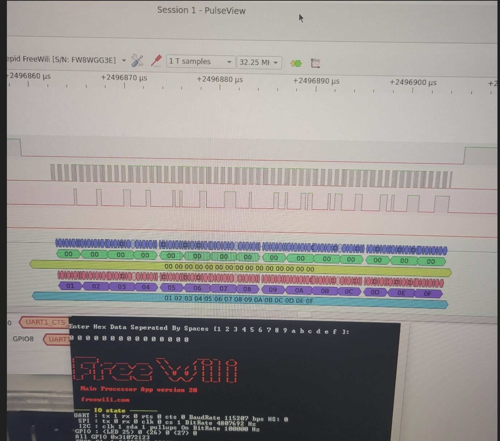

# Logic Analyzer

The default [FPGA](/hardware-low-level-details/ice40-fpga/) configuration implements a Logic Analyzer compatible with [Sigrok Pulseview](https://sigrok.org/wiki/PulseView). This logic analyzer uses the FPGA front end and communicates with the PC using the FTDI High speed user interface. The Logic Analyzer operates **transparently** to the IO features of FREE-WILi so you can use it to test when you are interfacing to digital protocols.

The FPGA bit files for the logic analyzer are always being implemented and are open source. These are available at the FREE-WILi [github](https://github.com/freewili/). You can change the default FPGA bit file in the [settings](/io-app/settings-menu/) of FREE-WILi.

<figure>

<figcaption>Analyze your digital protocols without attaching wires</figcaption>
</figure>

