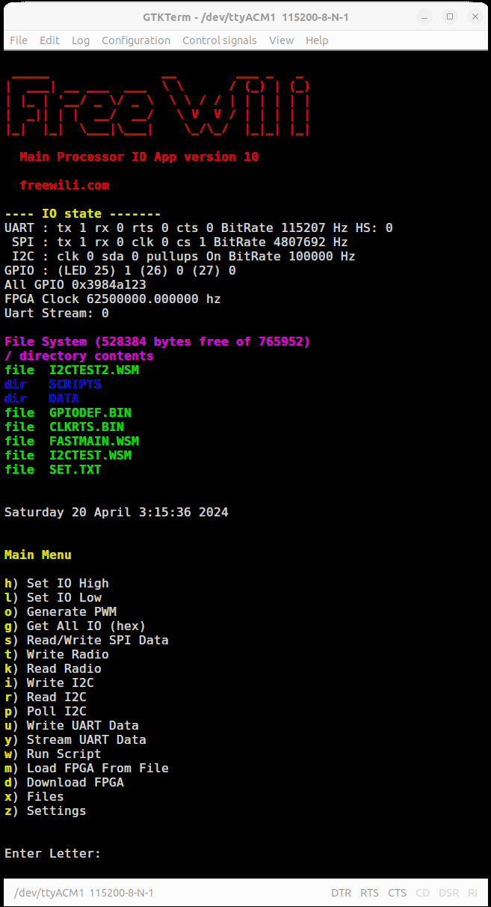

# Main Menu Header

At the top of the main menu there is information on the setup and state of the FREE-WILi IOs. 

The IO state shows the PIN states and configuration of the UART, SPI, I2C and GPIOs. It also shows  the FPGA clock and if UART streaming is enabled.

After the IO state the file system contents are shown for the current directory.

Finally the current real time clock setting is shown.

<figure>

<figcaption>The top of the main menu has information about the FREE-WILi configuration.</figcaption>
</figure>

