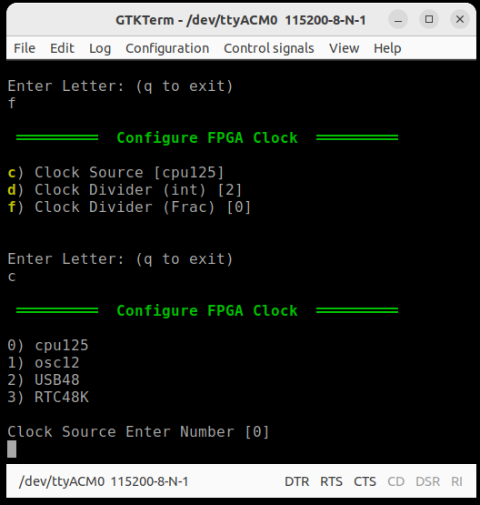

# FPGA Settings

The FPGA settings are shown below:

| **Name**             	| **Description**                                             	| **Notes**                                                                                                                                             	|
|----------------------	|-------------------------------------------------------------	|-------------------------------------------------------------------------------------------------------------------------------------------------------	|
| Clock Source         	| This is the internal clock used to generate the FPGA Clock  	| There are 4 options: the main PLL generated clock 125 Mhz, the 12 Mhz source oscillator, the 48 Mhz USB clock, and the internal 48khz RC analog clock 	|
| Clock divider (int)  	| The integer part of the divider applied to the clock source 	|                                                                                                                                                       	|
| Clock divider (frac) 	| The fractional part of clock divider                        	|                                                                                                                                                       	|

<figure>

<figcaption>The FPGA settings.</figcaption>
</figure>

