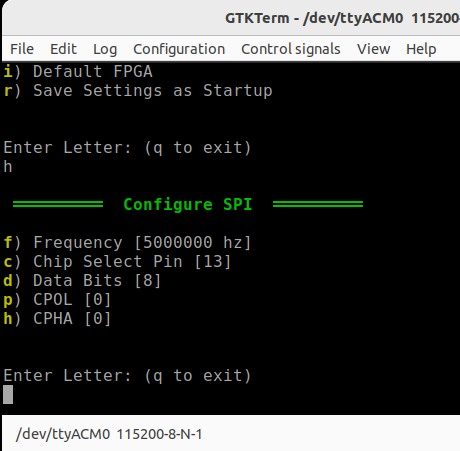

# SPI Settings

SPI settings are listed below.  The settings are configured using the menu shown below.

| **Setting**     	| **Description**             	| **Notes**                                                                                	|
|-----------------	|-----------------------------	|------------------------------------------------------------------------------------------	|
| Frequency       	| SPI Clock Frequency         	|                                                                                          	|
| Chip Select Pin 	| GPIO used for Chip select.  	| GPIO must be configured for output.                                                      	|
| Data bits       	| The width of the spi bytes  	| (only 8 is currently supported)                                                          	|
| CPOL            	| clock polarity              	| Refer to RP2040 data sheet section 4.10 on clock phase and polarity. Most common is 0,0. 	|
| CPHA            	| clock phase                 	|                                                                                          	|

 

<figure>

<figcaption>SPI has 5 settings</figcaption>
</figure>

