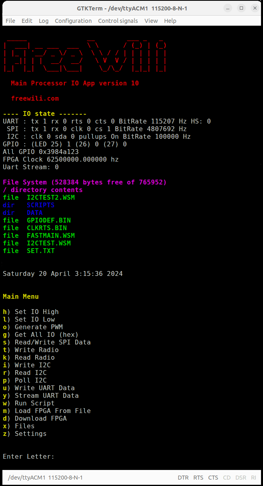

# Main Menu Commands

Commands are a single letter. After you enter the letter additonal information is entered. The following command are available from the main menu:

| **Command** 	|   **Description**   	|                     **Arguments**                    	|                               **Notes**                              	|
|:-----------:	|:-------------------:	|:----------------------------------------------------:	|:--------------------------------------------------------------------:	|
|      h      	|     set io high     	|                      gpio number                     	|                                                                      	|
|      l      	|      set io low     	|                      gpio number                     	|                                                                      	|
|      o      	|     generate pwm    	|        gpio number, frequency, and duty cycle        	|                                                                      	|
|      g      	|      get all io     	|                                                      	|    Returns the state of all 32 IO of the FREE-WILi processor in hex   |
|      s      	|    read/write spi   	|                  the spi write bytes                 	|                     Returns the read bytes in hex                    	|
|      t      	|     write radio     	|           the radio index, and data in hex           	|                                                                      	|
|      k      	|      read radio     	|           the radio index and count of read          	|                         Returns the data read                        	|
|      i      	|      write i2c      	| device address, register, and additional write bytes 	|                                                                      	|
|      r      	|       read i2c      	|       device address, register and read length       	|                         Returns the data read                        	|
|      p      	|       poll i2c      	|                                                      	|        Returns a table of i2c address that responded to a read       	|
|      u      	|      write uart     	|                  write bytes in hex                  	|                                                                      	|
|      y      	|     stream uart     	|                                                      	|            toggles on and off of sending uart data to host           	|
|      w      	|      run script     	|             name of script in file system            	|                                                                      	|
|      m      	| load fpga from file 	|         name of fpga bit file in file systems        	|                                                                      	|
|      d      	|    download fpga    	|                  fpga bit file bytes                 	| send raw FPGA bits after this command. This has a 10 second timeout. 	|
|      x      	|        files        	|                                                      	|                         Access the files menu                        	|
|      z      	|       settings      	|                                                      	|                       Access the settings menu                       	|

<figure>

<figcaption>The Main Menu access the core FREE-WILi Features.</figcaption>
</figure>

