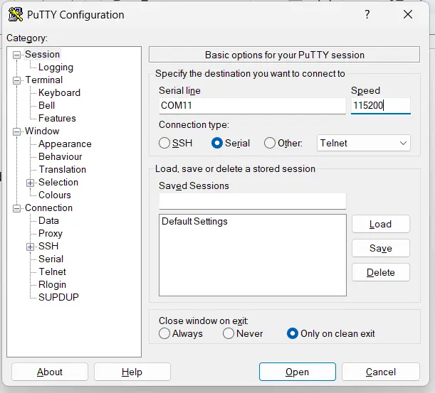
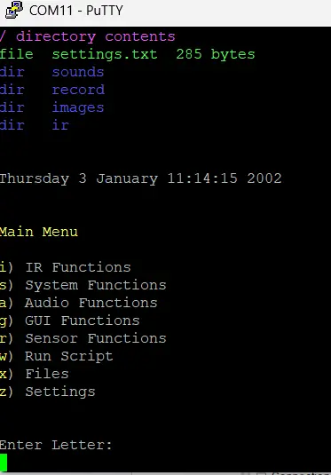
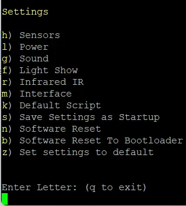
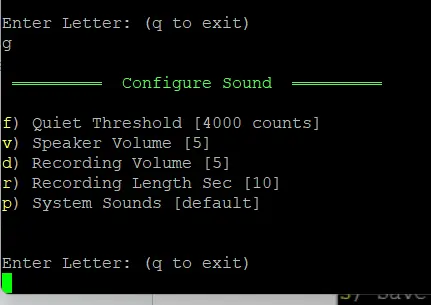
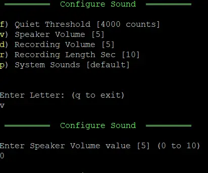
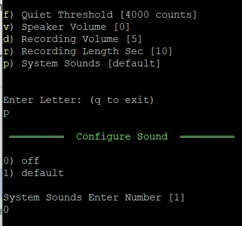
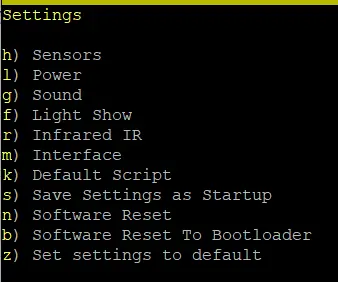
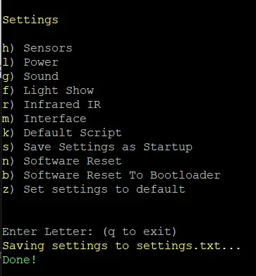

# How to Disable FREE-WILi Boot Sounds via Serial CLI

This tutorial explains **how to disable the boot and system sounds** on your FREE-WiLi display using a serial CLI connection.

## 🔌 Connecting via PuTTY

1. Launch **PuTTY**.
2. In the **"Category"** pane, select **Session**.
3. Select **Serial** as the connection type.
4. Set the **Serial line** (e.g., COM11).  
   - Note - You can find the correct COM port in **Device Manager**.
5. Set **Speed** to `115200`.
6. Click **Open** to to initiate the connection.

<figure>

<figcaption>Connecting with PuTTY</figcaption>
</figure>

## ⚙️ Configuring Sound Settings

1. From the **Main Menu**, press `z` to go to **Settings**.

<figure>

<figcaption>Navigate to Settings</figcaption>
</figure>

  

<figure>

<figcaption>Select Settings</figcaption>
</figure>

 

2. Once in the "Settings" menu, press `g` to open **Sound** configuration.

<figure>

<figcaption>Configure Sound</figcaption>
</figure>

3. To adjust the speaker volume, press `v` to adjust volume.
   - When prompted, enter `0` and press **Enter** to set the volume to zero.

<figure>

<figcaption>Adjust Speaker Volume</figcaption>
</figure>

4. Press `p` to disable system sounds.
   - Enter `0` and press **Enter** to turn sounds select **off**.

<figure>

<figcaption>Disable Sound</figcaption>
</figure>

## 💾 Saving the Configuration

1. Press `q` to exit the **"Configure Sound"** menu and return to the **"Settings"** menu.

<figure>

<figcaption>Select Settings</figcaption>
</figure>

2. Press `s` to **Save Settings as Startup**.

<figure>

<figcaption>Save Settings as Startup</figcaption>
</figure>

3. A confirmation message:  
   > `Saving Settings to settings.txt...` will appear.

<figure>

<figcaption>Confirm Settings</figcaption>
</figure>

4. The FREE-WILi startup sound is now successfully disabled.✅

## 📝 Related

- [FREE-WiLi Product Overview](/)